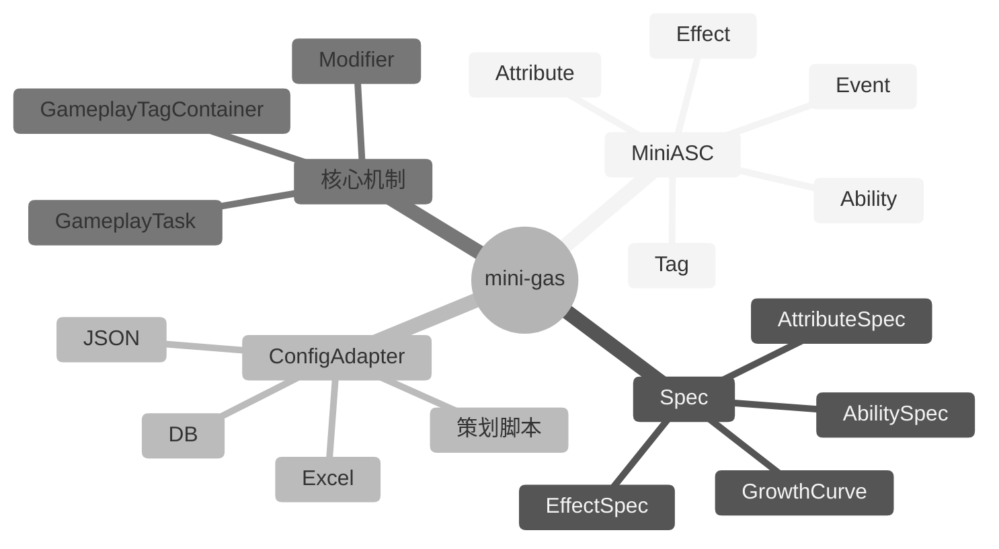
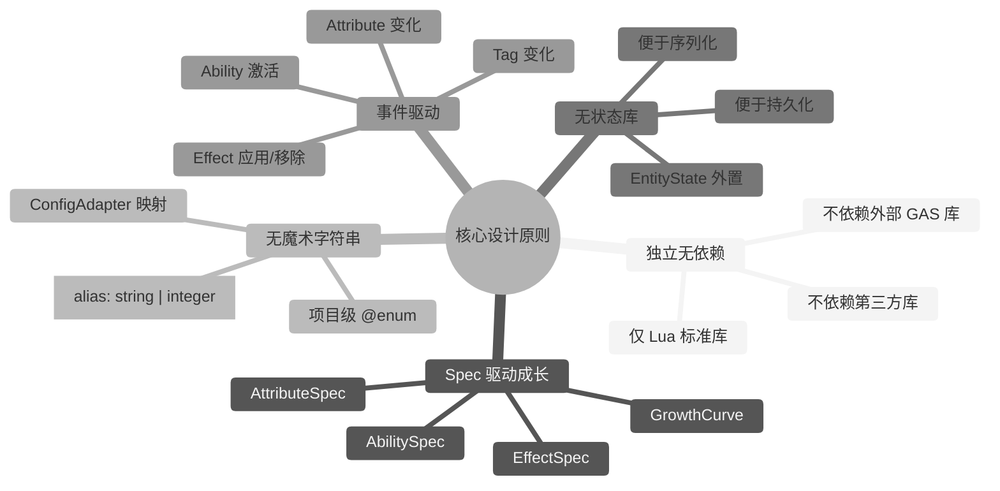
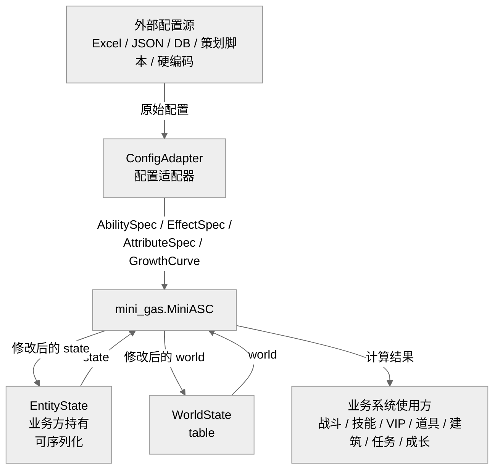
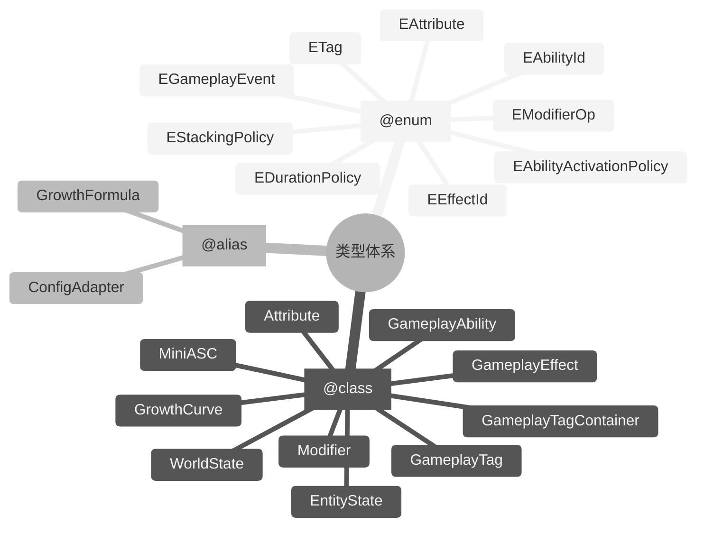
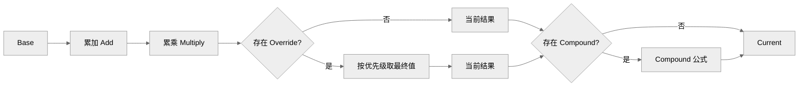
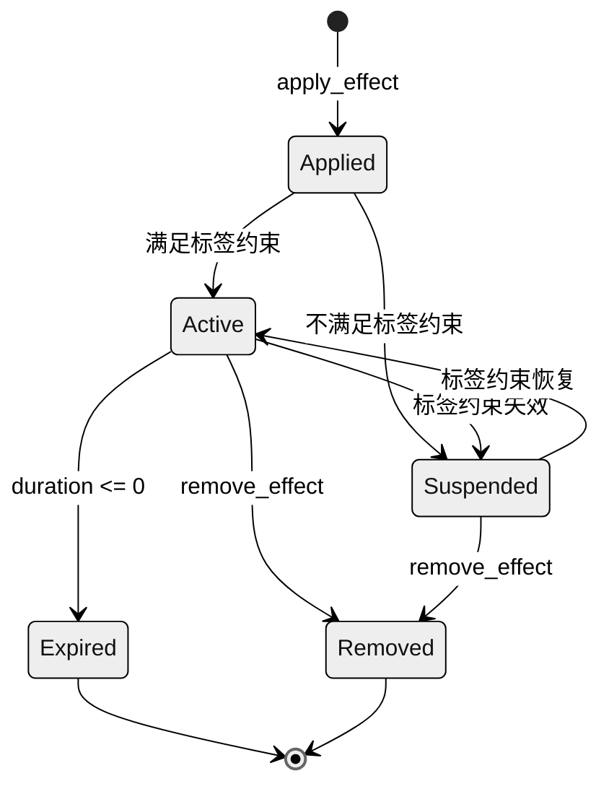
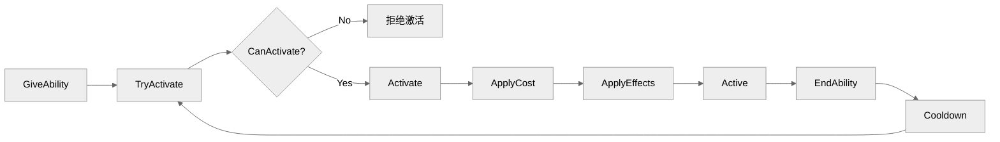
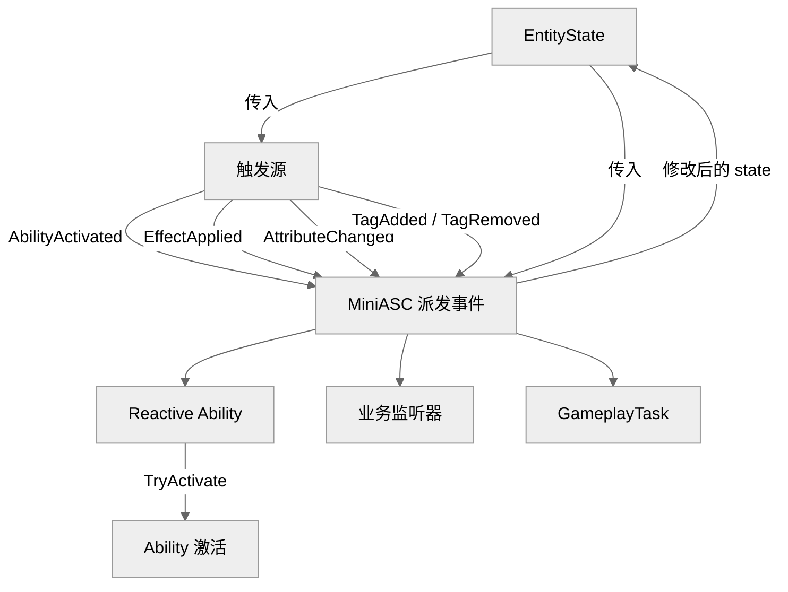
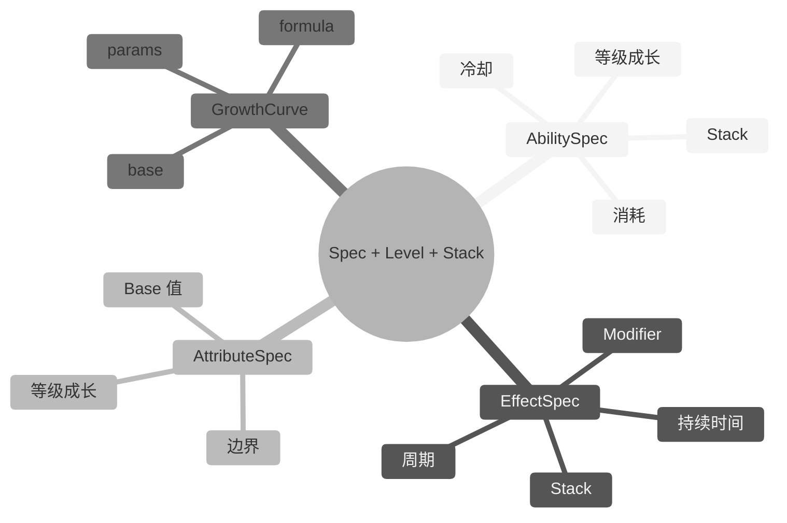

# Mini-GAS 设计文档

> 文档版本：v2.0  
> 编写日期：2026-06-14  
> 目标读者：服务端开发者、数值/系统策划  
> 关联项目：[cgas](../../../) — 基于 Lua 的 GAS 库

---

## 1. 背景与目标

### 1.1 背景

Gameplay Ability System（GAS）参考 Unreal Engine 的设计思想，覆盖 Ability、AttributeSet、Effect、Tag、Cue、Task 等子系统，适合客户端+服务端联动的复杂战斗系统。

但在很多服务端场景中，我们仍需要一个**轻量、独立、可成长**的 GAS 核心：

- 英雄、宠物、装备、技能、Buff 的成长性计算。
- 标签驱动的技能激活、效果触发、状态机切换。
- 支持永久、瞬时、持续、周期性多种 Effect。
- 支持冷却、消耗、Stack、等级缩放。
- **代码自包含**，避免与外部 GAS 实现相互污染，便于独立演进与维护。

因此设计 `mini-gas` v2.0：在保留 GAS 核心思想（Ability / Tag / Effect / Modifier / Attribute）的同时，构建一个**自包含、Spec 驱动、面向成长**的轻量服务端 GAS 引擎。

### 1.2 目标

- **核心子系统**：具备 GameplayAbility、GameplayTag、GameplayEffect、Modifier、Attribute 等核心能力。
- **代码独立**：目录独立为 `lua_lib/mini_gas`，不依赖任何外部 GAS 实现或共享源码文件。
- **Spec 驱动成长**：所有可成长对象（Ability / Effect / Attribute）均通过 Spec 定义，支持等级、Stack、成长曲线。
- **无魔术字符串**：所有标识符、标签、属性名、操作类型均通过 `@enum` 常量或 `@class` 类型定义，禁止在业务代码中直接书写字面量。
- **无状态库**：`mini-gas` 自身不维护任何运行时状态，所有状态由调用方通过 `EntityState` 传入并持有，便于序列化与持久化。
- **配置无关**：不绑定任何配置格式，通过适配器函数桥接任意配置源。

---

## 2. 范围

### 2.1 包含内容

| 模块 | 说明 |
|------|------|
| GameplayAbility（技能） | 主动/被动/响应式技能，含激活条件、冷却、消耗、等级、Stack |
| GameplayTag（标签） | 层级标签系统，支持精确匹配、父级匹配、Granted 标签管理 |
| GameplayEffect（效果） | 对 Attribute 的修改单元，支持 Instant / Infinite / HasDuration / Periodic |
| Modifier（修饰器） | 对属性的修改方式：Add、Multiply、Override、Compound |
| Attribute（属性） | 数值定义，支持 Base 值与 Current 值，支持成长曲线 |
| AttributeSet（属性集） | 一组相关 Attribute 的集合，便于批量注册与管理 |
| MiniASC（能力系统组件） | 运行时入口，持有 Ability、Effect、Attribute、Tag |
| GameplayEvent（游戏事件） | 技能与效果之间的触发/监听机制 |
| GameplayTask（轻量任务） | 延时、周期、等待事件等轻量异步任务 |
| Spec 系统 | AbilitySpec、EffectSpec、AttributeSpec，支持等级、Stack、成长曲线 |
| ConfigAdapter（配置适配器） | 将外部配置转换为 Spec 的桥梁 |



### 2.2 明确不包含

- 网络同步 / 客户端预测 / 服务端权威回滚
- 3D 渲染 / 动画 / 音效表现层（GameplayCue 可保留事件层，但不包含具体渲染）
- 物理 / 碰撞检测
- 数据持久化（由业务方负责）
- 复杂可视化编辑器

> 当项目需要这些能力时，应通过外部系统扩展或在架构上将 `mini-gas` 作为独立层通过适配器桥接。

---

## 3. 核心设计原则

### 3.1 独立无依赖

`mini-gas` 仅依赖 Lua 标准库，不依赖任何外部 GAS 库或第三方库。所有类型、工具函数均在 `lua_lib/mini_gas` 内自包含。

### 3.2 Spec 驱动成长

游戏中的英雄、技能、装备、Buff 都具有成长性。`mini-gas` 通过 **Spec** 描述这些对象的等级、Stack、成长曲线，运行时由 `MiniASC` 根据 Spec 实例化并更新。

### 3.3 无魔术字符串

所有标识符均通过 `@enum` 或 `@class` 定义，且其值对应策划配置的 `alias`（`string | integer`）：

- 属性名：`mini_gas.EAttribute`（框架不预定义业务属性；由策划配置）
- 标签名：`mini_gas.ETag`（框架不预定义业务标签；由策划配置）
- 技能 ID：`mini_gas.EAbilityId`（框架不预定义业务技能；由策划配置）
- 效果 ID：`mini_gas.EEffectId`（框架不预定义业务效果；由策划配置）
- 事件名：`mini_gas.EGameplayEvent`（框架仅预定义生命周期事件；业务事件由策划配置）
- 修饰操作：`mini_gas.EModifierOp`
- 生命周期策略：`mini_gas.EDurationPolicy`
- 技能激活策略：`mini_gas.EAbilityActivationPolicy`

业务代码禁止直接书写 `"attr.max_hp"`、`"Add"`、`"ability.attack"` 等字面量。业务 ID 应由策划配置并通过 `ConfigAdapter` 映射到项目级 `@enum`。

### 3.4 无状态库

`mini-gas` 自身不维护任何运行时状态。所有状态由调用方通过 `EntityState` 传入并持有，业务系统可同时存在任意多个 `EntityState` 实例，互不干扰。状态外置后可直接序列化，便于保存、加载、网络同步与回放。

### 3.5 事件驱动

技能激活、效果触发、标签变化、属性变化均通过 `GameplayEvent` 进行通知，便于业务系统扩展。



---

## 4. 架构





---

## 5. 类型与枚举定义

以下所有类型与枚举均使用 LuaCATS 的 `---@class` 与 `---@enum` 语法定义，禁止在业务代码中使用魔术字符串。

> **ID 与策划 Alias**：属性、标签、技能、效果、事件等 ID 均对应策划配置的 `alias`，其值类型为 `string | integer`。`mini-gas` 框架仅预定义其运行所必须的最小核心常量；业务逻辑所需的 ID 应由策划配置并通过 `ConfigAdapter` 映射到项目级 `@enum`，不得在框架层硬编码。

### 5.1 基础枚举

#### 5.1.1 修饰器操作类型

```lua
---@enum mini_gas.EModifierOp
local EModifierOp = {
    Add = 1,            -- 加法，聚合为 sum
    Multiply = 2,       -- 乘法，聚合为 product
    Override = 3,       -- 覆盖，按优先级取最终值
    Compound = 4,       -- 复合公式，由自定义函数计算
}
```

#### 5.1.2 效果生命周期策略

```lua
---@enum mini_gas.EDurationPolicy
local EDurationPolicy = {
    Instant = 1,        -- 瞬时生效，立即修改 Base 或 Current 后消失
    Infinite = 2,       -- 永久生效，直到被显式移除
    HasDuration = 3,    -- 持续一段时间后自动消失
}
```

#### 5.1.3 效果叠加策略

```lua
---@enum mini_gas.EStackingPolicy
local EStackingPolicy = {
    None = 1,           -- 不可叠加，重复应用时刷新或替换
    Add = 2,            -- Stack 数相加
    Replace = 3,        -- 新效果替换旧效果
    Refresh = 4,        -- 刷新持续时间与 Stack
}
```

#### 5.1.4 技能激活策略

```lua
---@enum mini_gas.EAbilityActivationPolicy
local EAbilityActivationPolicy = {
    Passive = 1,        -- 授予后自动持续生效
    Active = 2,         -- 需要业务方显式调用 TryActivate
    Reactive = 3,       -- 响应特定 GameplayEvent 自动尝试激活
}
```

#### 5.1.5 属性枚举

`mini-gas` 框架不预定义业务属性 ID；以下仅保留占位常量。业务属性 ID 及其 `alias`（`string | integer`）由策划配置，并通过项目级 `@enum` 维护。

```lua
---@enum mini_gas.EAttribute
local EAttribute = {
    None = "attr.none", -- 占位；业务 Attribute ID 由策划配置
}
```

#### 5.1.6 标签枚举

`mini-gas` 框架运行不依赖任何业务标签，因此仅保留占位常量。所有业务标签（如 `state.combat`、`buff.attack_aura`）应由策划配置，并在项目级 `@enum` 中维护，其 `alias` 类型为 `string | integer`。

```lua
---@enum mini_gas.ETag
local ETag = {
    None = "tag.none", -- 占位；业务 Tag 由策划配置
}
```

#### 5.1.7 技能 ID 枚举

`mini-gas` 框架不预定义业务技能 ID；以下仅保留占位常量。业务技能 ID 及其 `alias`（`string | integer`）由策划配置，并在项目级 `@enum` 中维护。

```lua
---@enum mini_gas.EAbilityId
local EAbilityId = {
    None = "ability.none", -- 占位；业务 Ability ID 由策划配置
}
```

#### 5.1.8 效果 ID 枚举

`mini-gas` 框架不预定义业务效果 ID；以下仅保留占位常量。业务效果 ID 及其 `alias`（`string | integer`）由策划配置，并在项目级 `@enum` 中维护。

```lua
---@enum mini_gas.EEffectId
local EEffectId = {
    None = "effect.none", -- 占位；业务 Effect ID 由策划配置
}
```

#### 5.1.9 游戏事件枚举

`mini-gas` 框架仅预定义其内部生命周期相关事件；业务事件（如 `event.damage.taken`）应由策划配置并在项目级 `@enum` 中维护，其 `alias` 类型为 `string | integer`。

```lua
---@enum mini_gas.EGameplayEvent
local EGameplayEvent = {
    AbilityActivated = "event.ability.activated",
    AbilityEnded = "event.ability.ended",
    EffectApplied = "event.effect.applied",
    EffectRemoved = "event.effect.removed",
    AttributeChanged = "event.attribute.changed",
    TagAdded = "event.tag.added",
    TagRemoved = "event.tag.removed",
}
```

### 5.2 核心类型

#### 5.2.1 游戏标签

```lua
---@class mini_gas.GameplayTag
---@field name string 标签完整名称
local GameplayTag = {}

---构造标签
---@param tag mini_gas.ETag
---@return mini_gas.GameplayTag
function GameplayTag.new(tag) end

---判断自身是否匹配另一个标签（精确或父级）
---@param other mini_gas.GameplayTag
---@return boolean
function GameplayTag:matches(other) end
```

#### 5.2.2 标签容器

```lua
---@class mini_gas.GameplayTagContainer
---@field tags table<string, mini_gas.GameplayTag>
local GameplayTagContainer = {}

---添加标签
---@param tag mini_gas.ETag
function GameplayTagContainer:add(tag) end

---移除标签
---@param tag mini_gas.ETag
function GameplayTagContainer:remove(tag) end

---判断是否包含指定标签（支持父级匹配）
---@param tag mini_gas.ETag
---@return boolean
function GameplayTagContainer:has(tag) end

---判断是否包含任意一个标签
---@param tags mini_gas.ETag[]
---@return boolean
function GameplayTagContainer:has_any(tags) end

---判断是否包含所有标签
---@param tags mini_gas.ETag[]
---@return boolean
function GameplayTagContainer:has_all(tags) end
```

#### 5.2.3 成长曲线

成长曲线**必须通过公式计算**，禁止内置等级查表。公式接收当前等级 `level`、基础值 `base` 与参数表 `params`，返回当前数值。

```lua
---@alias mini_gas.GrowthFormula fun(level: number, base: number, params: table|nil): number

---@class mini_gas.GrowthCurve
---@field base number 基础值
---@field params table|nil 公式参数（如线性系数、指数底数等）
---@field formula mini_gas.GrowthFormula
local GrowthCurve = {}

---根据等级与公式计算数值
---@param level number
---@return number
function GrowthCurve:value_at(level) end
```

#### 5.2.4 属性定义

```lua
---@class mini_gas.AttributeDef
---@field name mini_gas.EAttribute
---@field alias string|integer|nil 策划配置原始 ID；nil 时使用 name 的枚举值
---@field base number
---@field min number|nil
---@field max number|nil
---@field growth mini_gas.GrowthCurve|nil
```

#### 5.2.5 属性实例

```lua
---@class mini_gas.Attribute
---@field name mini_gas.EAttribute
---@field base number 基础值（受成长曲线影响）
---@field current number 当前值（受 Modifier 影响后的结果）
local Attribute = {}

---设置 Base 值
---@param value number
function Attribute:set_base(value) end

---获取 Base 值
---@return number
function Attribute:get_base() end

---获取 Current 值
---@return number
function Attribute:get_current() end
```

#### 5.2.6 修饰器定义

```lua
---@class mini_gas.ModifierDef
---@field attribute mini_gas.EAttribute
---@field op mini_gas.EModifierOp
---@field value number|mini_gas.GrowthCurve
---@field priority number|nil 仅 Override/Compound 时使用
---@field require_tags mini_gas.ETag[] 该 Modifier 生效所需的标签
---@field forbid_tags mini_gas.ETag[] 该 Modifier 生效所禁止的标签
```

#### 5.2.7 修饰器实例

```lua
---@class mini_gas.Modifier
---@field def mini_gas.ModifierDef
---@field level number
---@field source any
local Modifier = {}

---获取当前等级下的实际数值
---@return number
function Modifier:value() end
```

#### 5.2.8 效果定义

```lua
---@class mini_gas.EffectDef
---@field id mini_gas.EEffectId
---@field alias string|integer|nil 策划配置原始 ID；nil 时使用 id 的枚举值
---@field duration_policy mini_gas.EDurationPolicy
---@field duration number|mini_gas.GrowthCurve|nil 单位：秒
---@field period number|mini_gas.GrowthCurve|nil 单位：秒
---@field modifiers mini_gas.ModifierDef[]
---@field stacking mini_gas.EStackingPolicy
---@field max_stack number|nil
---@field granted_tags mini_gas.ETag[]
---@field require_tags mini_gas.ETag[]
---@field forbid_tags mini_gas.ETag[]
---@field source any
```

#### 5.2.9 效果实例

```lua
---@class mini_gas.GameplayEffect
---@field spec mini_gas.EffectDef
---@field level number
---@field stack number
---@field elapsed number
---@field remaining number
---@field last_trigger_count number
local GameplayEffect = {}

---获取当前等级与 Stack 下的实际 Modifier 列表
---@return mini_gas.Modifier[]
function GameplayEffect:active_modifiers() end
```

#### 5.2.10 技能定义

```lua
---@class mini_gas.GameplayAbilityDef
---@field id mini_gas.EAbilityId
---@field alias string|integer|nil 策划配置原始 ID；nil 时使用 id 的枚举值
---@field activation_policy mini_gas.EAbilityActivationPolicy
---@field cooldown number|mini_gas.GrowthCurve
---@field cost table<mini_gas.EAttribute, number|mini_gas.GrowthCurve>|nil
---@field require_tags mini_gas.ETag[]
---@field forbid_tags mini_gas.ETag[]
---@field grant_tags mini_gas.ETag[]
---@field activation_event mini_gas.EGameplayEvent|nil  Reactive 时使用
---@field effects mini_gas.EffectDef[] 激活时自动应用的效果
---@field source any
```

#### 5.2.11 技能实例

```lua
---@class mini_gas.GameplayAbility
---@field spec mini_gas.GameplayAbilityDef
---@field level number
---@field stack number
---@field is_active boolean
---@field cooldown_remaining number
local GameplayAbility = {}

---检查当前是否可以激活
---@param state mini_gas.EntityState
---@return boolean
function GameplayAbility:can_activate(state) end

---激活技能
---@param state mini_gas.EntityState
---@param payload table|nil
function GameplayAbility:activate(state, payload) end

---结束技能
---@param state mini_gas.EntityState
function GameplayAbility:end_ability(state) end
```

#### 5.2.12 实体状态

`EntityState` 是纯 Lua 表，由业务方创建并持有，便于序列化与持久化。`mini-gas` 库本身不维护任何状态，所有状态均通过 `EntityState` 参数传递。

```lua
---@class mini_gas.EntityState
---@field attributes table<mini_gas.EAttribute, mini_gas.Attribute>
---@field abilities table<string, mini_gas.GameplayAbility>
---@field effects table<string, mini_gas.GameplayEffect>
---@field tags mini_gas.GameplayTagContainer
---@field event_listeners table<mini_gas.EGameplayEvent, fun(payload:table|nil)[]>
---@field source any
local EntityState = {}

---创建新的实体状态
---@return mini_gas.EntityState
function EntityState.new() end
```

#### 5.2.13 世界状态

`WorldState` 是 `table<EntityId, EntityState>`，由业务方创建并持有，用于管理多个实体状态，便于批量更新与统一序列化。`mini-gas` 不通过 `WorldState` 维护跨实体链接，实体间的相互影响仍通过 **Tag** 与共享的 `EntityState` 实现。

```lua
---@class mini_gas.WorldState
---@field entities table<string, mini_gas.EntityState>
local WorldState = {}

---创建新的世界状态
---@return mini_gas.WorldState
function WorldState.new() end

---注册实体状态
---@param self mini_gas.WorldState
---@param id string
---@param state mini_gas.EntityState
function WorldState:register_entity(id, state) end
```

#### 5.2.14 能力系统组件

`MiniASC` 是**无状态**的函数集合，所有操作均接收 `EntityState` 或 `WorldState` 作为第一个参数，执行计算后返回结果或修改传入的状态。

```lua
---@class mini_gas.MiniASC
local MiniASC = {}

---注册属性定义
---@param state mini_gas.EntityState
---@param defs mini_gas.AttributeDef[]
function MiniASC.register_attributes(state, defs) end

---授予技能
---@param state mini_gas.EntityState
---@param spec mini_gas.GameplayAbilityDef
---@param level number
---@param stack number|nil
function MiniASC.give_ability(state, spec, level, stack) end

---移除技能
---@param state mini_gas.EntityState
---@param ability_id mini_gas.EAbilityId
function MiniASC.remove_ability(state, ability_id) end

---设置技能等级
---@param state mini_gas.EntityState
---@param ability_id mini_gas.EAbilityId
---@param level number
function MiniASC.set_ability_level(state, ability_id, level) end

---设置技能 Stack
---@param state mini_gas.EntityState
---@param ability_id mini_gas.EAbilityId
---@param stack number
function MiniASC.set_ability_stack(state, ability_id, stack) end

---尝试激活技能
---@param state mini_gas.EntityState
---@param ability_id mini_gas.EAbilityId
---@param payload table|nil
---@return boolean
function MiniASC.try_activate_ability(state, ability_id, payload) end

---应用效果
---@param state mini_gas.EntityState
---@param spec mini_gas.EffectDef
---@param level number
---@param stack number|nil
function MiniASC.apply_effect(state, spec, level, stack) end

---移除效果
---@param state mini_gas.EntityState
---@param effect_id mini_gas.EEffectId
function MiniASC.remove_effect(state, effect_id) end

---设置效果等级
---@param state mini_gas.EntityState
---@param effect_id mini_gas.EEffectId
---@param level number
function MiniASC.set_effect_level(state, effect_id, level) end

---设置效果 Stack
---@param state mini_gas.EntityState
---@param effect_id mini_gas.EEffectId
---@param stack number
function MiniASC.set_effect_stack(state, effect_id, stack) end

---添加标签
---@param state mini_gas.EntityState
---@param tag mini_gas.ETag
function MiniASC.add_tag(state, tag) end

---移除标签
---@param state mini_gas.EntityState
---@param tag mini_gas.ETag
function MiniASC.remove_tag(state, tag) end

---判断标签容器是否包含某标签
---@param state mini_gas.EntityState
---@param tag mini_gas.ETag
---@return boolean
function MiniASC.has_tag(state, tag) end

---派发事件
---@param state mini_gas.EntityState
---@param event mini_gas.EGameplayEvent
---@param payload table|nil
function MiniASC.dispatch_event(state, event, payload) end

---监听事件
---@param state mini_gas.EntityState
---@param event mini_gas.EGameplayEvent
---@param listener fun(payload:table|nil)
function MiniASC.listen_event(state, event, listener) end

---更新状态
---@param state mini_gas.EntityState
---@param dt number 秒
function MiniASC.update(state, dt) end

---批量更新世界状态
---@param world mini_gas.WorldState
---@param dt number 秒
function MiniASC.update_world(world, dt) end

---获取属性 Base 值
---@param state mini_gas.EntityState
---@param attr mini_gas.EAttribute
---@return number
function MiniASC.get_base(state, attr) end

---获取属性 Current 值
---@param state mini_gas.EntityState
---@param attr mini_gas.EAttribute
---@return number
function MiniASC.get_current(state, attr) end

---设置属性 Current 值
---@param state mini_gas.EntityState
---@param attr mini_gas.EAttribute
---@param value number
function MiniASC.set_current(state, attr, value) end
```

---

## 6. 核心机制

### 6.1 GameplayTag

#### 6.1.1 层级语义

标签采用点分层级结构，例如 `state.dead`、`effect.burning`。父级标签匹配所有子级标签：`state` 匹配 `state.dead`，`state.dead` 不匹配 `state.stunned`。

#### 6.1.2 Granted 标签（赋予标签）

- **Ability** 授予或 **Effect** 应用时，可通过 `grant_tags` / `granted_tags` 自动向实体添加一组标签。
- 技能/效果移除时，对应 Granted 标签自动移除（引用计数）。
- **效果的赋予应优先通过标签实现**：例如 VIP 效果授予 `buff.vip` 标签，建筑产出效果的倍率 Modifier 通过 `require_tags = {buff.vip}` 启用，从而实现系统间的相互影响，无需额外的跨实体链接机制。

#### 6.1.3 标签约束

- **Require Tags（需求标签）**：必须全部存在，技能/效果/Modifier 才能激活或生效。
- **Block Tags / Forbid Tags（禁用标签）**：任意一个存在，技能/效果/Modifier 即不能激活或生效。
- 约束检查在技能激活、效果应用、效果持续生效、Modifier 聚合时均会执行。

### 6.2 Attribute

#### 6.2.1 Base 与 Current

- **Base**：属性的基础值，通常由等级、装备、成长曲线决定，不随瞬时战斗波动。
- **Current**：属性的当前值，受 Effect 的 Modifier 影响后的结果。

#### 6.2.2 成长曲线

Attribute 的 Base 值可通过 `GrowthCurve` 随等级成长。`GrowthCurve` 必须提供公式函数，框架调用 `formula(level, base, params)` 计算数值；禁止通过等级查表实现。

#### 6.2.3 数值边界

每个 Attribute 可配置 `min` 与 `max`。`Current` 值在每次计算后被 Clamp 到边界内。`Hp` 等属性特别适合使用边界约束。

### 6.3 Modifier

#### 6.3.1 聚合顺序

以 `Base` 为起点，按以下顺序计算 `Current`：



#### 6.3.2 Modifier 标签约束

每个 Modifier 可单独配置 `require_tags` 与 `forbid_tags`。聚合时，只有满足标签约束的 Modifier 才会参与计算。这允许通过标签动态开启/关闭特定加成，例如：

- VIP 效果授予 `buff.vip` 标签。
- 建筑产出效果中的倍率 Modifier 设置 `require_tags = {buff.vip}`，仅在英雄拥有 VIP 时生效。

#### 6.3.3 等级缩放

Modifier 的 `value` 可以是 `number` 或 `GrowthCurve`。当为 `GrowthCurve` 时，根据 Effect/Ability 的等级动态取值。

### 6.4 GameplayEffect

#### 6.4.1 生命周期策略

| 策略 | 说明 |
|------|------|
| Instant | 立即执行一次 Modifier（通常是修改 Current 或 Base），不进入持续效果列表 |
| Infinite | 永久生效，直到被显式移除 |
| HasDuration | 持续 `duration` 秒后自动移除 |

#### 6.4.2 周期性效果

当 `period > 0` 时，Effect 在持续期间每隔 `period` 秒触发一次 Modifier 应用（通常是 `Add` 类型的资源产出或回血）。

#### 6.4.3 Stack 规则

- 同一 `effect_id` 再次应用时，根据 `stacking` 策略处理。
- `None`：替换旧效果。
- `Add`：Stack 数增加，不超过 `max_stack`。
- `Replace`：用新效果替换旧效果。
- `Refresh`：刷新持续时间，Stack 数不变或取较大值。

#### 6.4.4 标签约束

效果在应用时和每帧更新时都会检查 `require_tags` 与 `forbid_tags`。若不再满足条件，效果进入挂起状态，不应用 Modifier；条件恢复后继续生效。

此外，效果内部每个 Modifier 也有独立的 `require_tags` / `forbid_tags`。即使效果本身处于激活状态，不满足约束的单个 Modifier 也不会参与聚合。这实现了精细化的标签驱动加成。



### 6.5 GameplayAbility

#### 6.5.1 生命周期



#### 6.5.2 激活策略

| 策略 | 说明 |
|------|------|
| Passive | 授予后自动持续生效，通常用于天赋、光环 |
| Active | 需要业务方显式调用 `try_activate_ability` |
| Reactive | 监听指定 `activation_event`，事件发生时自动尝试激活 |

#### 6.5.3 激活条件

- 技能处于非冷却状态。
- 满足 `require_tags` 且不满足 `forbid_tags`。
- 满足消耗条件（Cost）。
- 业务可自定义 `can_activate` 回调。

#### 6.5.4 消耗

Cost 是一组 `{attribute, value}`，激活时从 `Current` 值中扣除。若任意一项不足，激活失败。

#### 6.5.5 冷却

- 技能激活后进入冷却，`cooldown_remaining` 从 `cooldown` 开始倒数。
- 冷却受等级成长曲线影响。

#### 6.5.6 激活时效果

技能激活时可自动应用一组 `EffectDef`，用于实现伤害、Buff、Debuff 等。

### 6.6 MiniASC

`MiniASC` 是 `mini-gas` 的运行时核心，但**自身不持有任何状态**。它以 `EntityState` 或 `WorldState` 为输入，职责包括：

- 读取并修改传入的 `EntityState` 中的 Attribute、Effect、Ability、Tag。
- 每帧 `update(state, dt)` 时推进 Effect 生命周期、触发周期效果、推进技能冷却。
- 通过 `update_world(world, dt)` 批量推进 `WorldState` 中所有实体的生命周期，便于统一更新。
- 执行 Modifier 聚合，计算 Attribute Current 值。
- 派发事件并通知 `EntityState` 中的监听者。
- 处理 Stack、等级、成长曲线的动态更新。

由于状态完全由调用方持有，`EntityState` 与 `WorldState` 可随时被序列化、保存、加载或通过网络同步。

### 6.7 GameplayEvent

事件是技能与效果之间解耦通信的重要手段：

- 技能激活/结束、效果应用/移除、标签变化、属性变化均会触发事件。
- Reactive 技能通过监听事件自动尝试激活。
- 业务系统可监听事件实现日志、任务、统计等功能。



---

## 7. Spec 系统（成长性）

### 7.1 设计目标

游戏中的对象普遍具有成长性：英雄升级、技能升级、装备强化、Buff 层数变化。`mini-gas` 通过 **Spec + Level + Stack** 模型统一描述成长性：

- **Spec**：定义对象的所有静态配置（如一个技能的冷却、消耗、效果）。
- **Level**：描述等级成长，影响数值、冷却、消耗、持续时间等。
- **Stack**：描述叠加层数，影响效果强度或触发次数。



### 7.2 AbilitySpec

```lua
---@class mini_gas.AbilitySpec
---@field def mini_gas.GameplayAbilityDef
---@field level number
---@field stack number
```

AbilitySpec 保存一个技能在特定等级与 Stack 下的实例化信息。`MiniASC.give_ability(state, ...)` 接收 `EntityState`、`GameplayAbilityDef` 与等级/Stack，创建对应的 `GameplayAbility` 并写入 `state`。

### 7.3 EffectSpec

```lua
---@class mini_gas.EffectSpec
---@field def mini_gas.EffectDef
---@field level number
---@field stack number
```

EffectSpec 保存一个效果在特定等级与 Stack 下的实例化信息。同一效果在不同等级下可能具有不同的 Modifier 数值与持续时间。

### 7.4 AttributeSpec

```lua
---@class mini_gas.AttributeSpec
---@field def mini_gas.AttributeDef
---@field level number
```

AttributeSpec 保存一个属性在特定等级下的 Base 值。等级变化时，`MiniASC` 根据传入的 `EntityState` 重新计算 Base 值并触发属性变化事件。

### 7.5 GrowthCurve 公式

`GrowthCurve` **只能通过公式计算**，不支持等级查表。业务方提供任意 `GrowthFormula`，框架在需要时调用：

```lua
---@param level number 当前等级
---@param base number 基础值
---@param params table|nil 公式参数
---@return number
local function linear_growth(level, base, params)
    return base + (level - 1) * (params and params.growth or 0)
end
```

公式可以是线性、指数、对数、分段函数等任何形式，只要符合 `GrowthFormula` 签名即可。策划配置中应描述公式类型与参数，由 `ConfigAdapter` 转换为具体的 `GrowthCurve`。

---

## 8. 配置桥接设计

### 8.1 设计原则

- `mini-gas` 不读取任何文件，也不解析任何配置格式。
- 所有配置通过**适配器函数**转换为 Spec 定义结构。
- 适配器由业务方提供，可复用、可替换。

### 8.2 适配器接口

```lua
---@alias mini_gas.ConfigAdapter fun(raw_config: any): mini_gas.GameplayAbilityDef|mini_gas.EffectDef|mini_gas.AttributeDef
```

业务方提供任意函数，输入原始配置，输出对应 Spec 定义。

### 8.3 示例：从 JSON 桥接 EffectSpec

以下示例展示策划使用 `integer` 作为 alias、成长使用公式、项目级 `@enum` 由业务维护。

策划 JSON 配置：

```json
{
  "id": 1001,
  "alias": "effect.attack_up",
  "duration_policy": "HasDuration",
  "duration": 30,
  "duration_growth": 0,
  "modifiers": [
    {"attribute": 1, "op": "Add", "value": 50, "growth": 10}
  ]
}
```

项目级枚举（由业务维护，基于策划 alias）：

```lua
---@enum project.EAttribute
local EAttribute = {
    Attack = 1, -- 对应策划配置的 attribute alias
}

---@enum project.EEffectId
local EEffectId = {
    AttackUp = 1001, -- 对应策划配置的 id alias
}

-- 策划 alias -> 项目枚举的反向映射
local attr_by_alias = {
    [1] = EAttribute.Attack,
}

local effect_by_alias = {
    [1001] = EEffectId.AttackUp,
}
```

通用线性成长公式：

```lua
---@type mini_gas.GrowthFormula
local function linear_growth(level, base, params)
    return base + (level - 1) * (params and params.growth or 0)
end
```

适配器实现：

```lua
---@param json_cfg table
---@return mini_gas.EffectDef
local function effect_adapter(json_cfg)
    local modifiers = {}
    for _, m in ipairs(json_cfg.modifiers) do
        table.insert(modifiers, {
            attribute = attr_by_alias[m.attribute], -- 通过策划 alias 映射到项目枚举
            op = EModifierOp[m.op],
            value = mini_gas.make_growth_curve(m.value, { growth = m.growth }, linear_growth),
        })
    end

    return {
        id = effect_by_alias[json_cfg.id],
        alias = json_cfg.alias,
        duration_policy = EDurationPolicy[json_cfg.duration_policy],
        duration = mini_gas.make_growth_curve(json_cfg.duration, { growth = json_cfg.duration_growth }, linear_growth),
        modifiers = modifiers,
    }
end
```

使用：

```lua
local state = EntityState.new()
MiniASC.register_attributes(state, {
    { name = EAttribute.Attack, base = 100 },
})

local effect_def = effect_adapter(json.decode(effect_config_text))
MiniASC.apply_effect(state, effect_def, 3, 1) -- 3 级时 value = 50 + (3-1)*10 = 70

-- state 为纯 Lua 表，可直接序列化
local saved = json.encode(state)
```

---

## 9. 目录结构

```
lua_lib/
└── mini_gas/                      -- 独立目录
    ├── init.lua                   -- 模块入口，导出所有公共 API
    ├── state.lua                  -- EntityState / WorldState
    ├── asc.lua                    -- MiniASC 无状态函数集合
    ├── ability.lua                -- GameplayAbility 与 AbilitySpec
    ├── effect.lua                 -- GameplayEffect 与 EffectSpec
    ├── modifier.lua               -- Modifier 聚合逻辑
    ├── attribute.lua              -- Attribute 与 AttributeSet
    ├── tag.lua                    -- GameplayTag 与 GameplayTagContainer
    ├── event.lua                  -- GameplayEvent 派发与监听
    ├── task.lua                   -- GameplayTask 轻量异步任务
    ├── spec.lua                   -- Spec 基础结构与 GrowthCurve
    └── enum.lua                   -- 所有枚举常量定义
```

> `mini-gas` 为自包含实现，所有代码均在 `lua_lib/mini_gas/` 内，不依赖任何外部 GAS 库。

---

## 10. API 汇总

### 10.1 模块入口

```lua
local mini_gas = require("mini_gas")
```

### 10.2 EntityState

| 方法 | 说明 |
|------|------|
| `EntityState.new()` | 创建新的空实体状态（可序列化的 Lua 表） |

### 10.3 WorldState

| 方法 | 说明 |
|------|------|
| `WorldState.new()` | 创建新的世界状态（`table<EntityId, EntityState>`） |
| `:register_entity(id, state)` | 注册实体状态 |

### 10.4 MiniASC

所有 `MiniASC` 方法均为无状态函数，第一个参数为 `state` 或 `world`。

| 方法 | 说明 |
|------|------|
| `MiniASC.register_attributes(state, defs)` | 批量注册属性定义 |
| `MiniASC.give_ability(state, spec, level, stack?)` | 授予技能 |
| `MiniASC.remove_ability(state, ability_id)` | 移除技能 |
| `MiniASC.set_ability_level(state, ability_id, level)` | 设置技能等级 |
| `MiniASC.set_ability_stack(state, ability_id, stack)` | 设置技能 Stack |
| `MiniASC.try_activate_ability(state, ability_id, payload?)` | 尝试激活技能 |
| `MiniASC.apply_effect(state, spec, level, stack?)` | 应用效果 |
| `MiniASC.remove_effect(state, effect_id)` | 移除效果 |
| `MiniASC.set_effect_level(state, effect_id, level)` | 设置效果等级 |
| `MiniASC.set_effect_stack(state, effect_id, stack)` | 设置效果 Stack |
| `MiniASC.add_tag(state, tag)` | 添加标签 |
| `MiniASC.remove_tag(state, tag)` | 移除标签 |
| `MiniASC.has_tag(state, tag)` | 判断是否包含标签 |
| `MiniASC.dispatch_event(state, event, payload?)` | 派发事件 |
| `MiniASC.listen_event(state, event, listener)` | 监听事件 |
| `MiniASC.update(state, dt)` | 推进时间并触发周期效果、冷却 |
| `MiniASC.update_world(world, dt)` | 批量推进 WorldState 中所有实体的生命周期 |
| `MiniASC.get_base(state, attr)` | 获取属性 Base 值 |
| `MiniASC.get_current(state, attr)` | 获取属性 Current 值 |
| `MiniASC.set_current(state, attr, value)` | 设置属性 Current 值 |

### 10.5 工具函数

```lua
---将原始配置批量转换为 EffectDef
---@param raw_configs any[]
---@param adapter mini_gas.ConfigAdapter
---@return mini_gas.EffectDef[]
function mini_gas.adapt_effects(raw_configs, adapter) end

---将原始配置批量转换为 AbilityDef
---@param raw_configs any[]
---@param adapter mini_gas.ConfigAdapter
---@return mini_gas.GameplayAbilityDef[]
function mini_gas.adapt_abilities(raw_configs, adapter) end

---计算单个属性的 Current 值（无状态纯函数）
---@param base number
---@param modifiers mini_gas.Modifier[]
---@return number
function mini_gas.calc_attribute(base, modifiers) end

---创建成长曲线
---@param base number
---@param params table|nil 公式参数
---@param formula mini_gas.GrowthFormula
---@return mini_gas.GrowthCurve
function mini_gas.make_growth_curve(base, params, formula) end
```

---

## 11. 实现要点

1. **纯 Lua 表**：不依赖任何外部库，除 Lua 标准库外无依赖。
2. **无状态库**：`mini-gas` 不维护任何运行时状态，所有状态由调用方通过 `EntityState` 或 `WorldState` 传入并持有，便于序列化、持久化与网络同步。
3. **代码自包含**：`lua_lib/mini_gas` 下所有文件不得引用任何外部 GAS 库。
4. **数值稳定**：Modifier 聚合顺序固定，避免浮点误差导致结果不稳定。
5. **效果去重与 Stack**：同一 `effect_id` 重复应用时，按 `EStackingPolicy` 处理，避免重复实例堆积。
6. **惰性计算**：`get_current` 可在 `update` 时预计算并缓存，避免每次读取都重新聚合。
7. **错误隔离**：非法 Modifier（目标属性不存在、未知 op）记录警告并不中断其他计算。
8. **事件解耦**：技能、效果、属性、标签的变化均通过事件通知，避免模块间直接耦合。
9. **等级与 Stack 动态更新**：支持运行时通过 `set_ability_level` / `set_ability_stack` / `set_effect_level` / `set_effect_stack` 改变 Ability / Effect 的等级与层数，并即时重算数值。
10. **冷却与消耗原子性**：技能激活时，冷却与消耗应作为一个原子操作，避免扣除消耗后激活失败导致状态不一致。
11. **策划 Alias 映射**：所有业务 ID（属性、标签、技能、效果、事件）的 `alias` 类型为 `string | integer`，由策划配置并通过 `ConfigAdapter` 映射到项目级 `@enum`；框架层不硬编码业务常量。
12. **公式化成长**：`GrowthCurve` 必须基于公式计算，禁止等级查表；公式由业务方提供，支持线性、指数、对数、分段等任意形式。
13. **标签驱动加成**：优先通过 `Granted Tag` 与 `Require / Block Tag` 实现效果的赋予与条件生效，避免引入额外的跨实体链接机制。

---

## 12. 使用示例

### 12.1 英雄基础属性 + 装备 + VIP

> 以下示例中的项目级枚举代表由策划配置、通过 `ConfigAdapter` 映射后的业务 ID；`mini-gas` 框架层不预定义这些业务常量。

```lua
local mini_gas = require("mini_gas")
local EntityState = mini_gas.EntityState
local MiniASC = mini_gas.MiniASC
local EModifierOp = mini_gas.EModifierOp
local EDurationPolicy = mini_gas.EDurationPolicy

-- 项目级枚举（来自策划配置的 alias）
---@enum project.EAttribute
local EAttribute = {
    MaxHp = "attr.max_hp",
    Attack = "attr.attack",
    Defense = "attr.defense",
    GoldGainRate = "attr.gold_gain_rate",
}

---@enum project.EEffectId
local EEffectId = {
    EquipmentSword = "effect.equipment.sword",
    VipLevel3 = "effect.vip.level_3",
}

-- 1. 创建实体状态（由业务方持有，可序列化）
local hero_state = EntityState.new()

-- 2. 注册英雄基础属性
MiniASC.register_attributes(hero_state, {
    { name = EAttribute.MaxHp,    base = 1000, min = 0 },
    { name = EAttribute.Attack,   base = 100,  min = 0 },
    { name = EAttribute.Defense,  base = 50,   min = 0 },
    { name = EAttribute.GoldGainRate, base = 1.0, min = 0 },
})

-- 3. 装备效果（永久）
MiniASC.apply_effect(hero_state, {
    id = EEffectId.EquipmentSword,
    duration_policy = EDurationPolicy.Infinite,
    modifiers = {
        { attribute = EAttribute.Attack, op = EModifierOp.Add, value = 50 },
    },
}, 1, 1)

-- 4. VIP 效果（永久）
MiniASC.apply_effect(hero_state, {
    id = EEffectId.VipLevel3,
    duration_policy = EDurationPolicy.Infinite,
    modifiers = {
        { attribute = EAttribute.GoldGainRate, op = EModifierOp.Multiply, value = 1.15 },
    },
}, 1, 1)

-- 5. 计算结果
print(MiniASC.get_current(hero_state, EAttribute.Attack))        -- 150
print(MiniASC.get_current(hero_state, EAttribute.GoldGainRate))  -- 1.15

-- 6. 状态可序列化后保存或网络同步
local serialized = json.encode(hero_state)
```

### 12.2 成长性技能：火球术

```lua
local EModifierOp = mini_gas.EModifierOp
local EDurationPolicy = mini_gas.EDurationPolicy
local EAbilityActivationPolicy = mini_gas.EAbilityActivationPolicy

-- 项目级枚举（来自策划配置的 alias）
---@enum project.EAbilityId
local EAbilityId = {
    Fireball = "ability.fireball",
}

---@enum project.EEffectId
local EEffectId = {
    FireballDamage = "effect.fireball.damage",
}

---@enum project.EAttribute
local EAttribute = {
    Hp = "attr.hp",
    Mp = "attr.mp",
}

-- 线性成长公式：value = base + (level - 1) * params.growth
---@type mini_gas.GrowthFormula
local function linear(level, base, params)
    return base + (level - 1) * (params and params.growth or 0)
end

local fireball_def = {
    id = EAbilityId.Fireball,
    activation_policy = EAbilityActivationPolicy.Active,
    cooldown = mini_gas.make_growth_curve(5, { growth = -0.2 }, linear), -- 每级冷却减少 0.2 秒
    cost = {
        [EAttribute.Mp] = mini_gas.make_growth_curve(20, { growth = 2 }, linear),
    },
    effects = {
        {
            id = EEffectId.FireballDamage,
            duration_policy = EDurationPolicy.Instant,
            modifiers = {
                {
                    attribute = EAttribute.Hp,
                    op = EModifierOp.Add,
                    value = mini_gas.make_growth_curve(-100, { growth = -15 }, linear), -- 每级伤害增加 15
                },
            },
        },
    },
}

MiniASC.give_ability(hero_state, fireball_def, 3, 1)
local ok = MiniASC.try_activate_ability(hero_state, EAbilityId.Fireball)
```

### 12.3 被动技能：攻击光环

```lua
local EModifierOp = mini_gas.EModifierOp
local EDurationPolicy = mini_gas.EDurationPolicy
local EAbilityActivationPolicy = mini_gas.EAbilityActivationPolicy

-- 项目级枚举（来自策划配置的 alias）
---@enum project.EAbilityId
local EAbilityId = {
    AttackAura = "ability.attack_aura",
}

---@enum project.EEffectId
local EEffectId = {
    AttackAura = "effect.attack_aura",
}

---@enum project.EAttribute
local EAttribute = {
    Attack = "attr.attack",
}

---@enum project.ETag
local ETag = {
    Buff_AttackAura = "buff.attack_aura",
}

local attack_aura_def = {
    id = EAbilityId.AttackAura,
    activation_policy = EAbilityActivationPolicy.Passive,
    grant_tags = { ETag.Buff_AttackAura },
    effects = {
        {
            id = EEffectId.AttackAura,
            duration_policy = EDurationPolicy.Infinite,
            granted_tags = { ETag.Buff_AttackAura },
            modifiers = {
                {
                    attribute = EAttribute.Attack,
                    op = EModifierOp.Multiply,
                    value = 1.2,
                },
            },
        },
    },
}

MiniASC.give_ability(hero_state, attack_aura_def, 1, 1)
-- 被动技能自动生效
```

### 12.4 响应式技能：受击反击

```lua
local EModifierOp = mini_gas.EModifierOp
local EDurationPolicy = mini_gas.EDurationPolicy
local EAbilityActivationPolicy = mini_gas.EAbilityActivationPolicy

-- 项目级枚举（来自策划配置的 alias）
---@enum project.EAbilityId
local EAbilityId = {
    CounterAttack = "ability.counter_attack",
}

---@enum project.EEffectId
local EEffectId = {
    CounterDamage = "effect.counter.damage",
}

---@enum project.EAttribute
local EAttribute = {
    Hp = "attr.hp",
}

---@enum project.ETag
local ETag = {
    State_Combat = "state.combat",
    State_Stunned = "state.stunned",
}

---@enum project.EGameplayEvent
local EGameplayEvent = {
    DamageTaken = "event.damage.taken",
}

local counter_attack_def = {
    id = EAbilityId.CounterAttack,
    activation_policy = EAbilityActivationPolicy.Reactive,
    activation_event = EGameplayEvent.DamageTaken,
    require_tags = { ETag.State_Combat },
    forbid_tags = { ETag.State_Stunned },
    cooldown = 3,
    effects = {
        {
            id = EEffectId.CounterDamage,
            duration_policy = EDurationPolicy.Instant,
            modifiers = {
                { attribute = EAttribute.Hp, op = EModifierOp.Add, value = -50 },
            },
        },
    },
}

MiniASC.give_ability(hero_state, counter_attack_def, 1, 1)
-- 当 DamageTaken 事件触发且满足标签条件时，自动尝试激活
```

### 12.5 周期性效果：主城建筑产出

```lua
local EModifierOp = mini_gas.EModifierOp
local EDurationPolicy = mini_gas.EDurationPolicy

-- 项目级枚举（来自策划配置的 alias）
---@enum project.EAttribute
local EAttribute = {
    IronOutput = "attr.iron_output",
}

---@enum project.EEffectId
local EEffectId = {
    BuildingIronMine = "effect.building.iron_mine",
}

local city_state = EntityState.new()
MiniASC.register_attributes(city_state, {
    { name = EAttribute.IronOutput, base = 0, min = 0 },
})

MiniASC.apply_effect(city_state, {
    id = EEffectId.BuildingIronMine,
    duration_policy = EDurationPolicy.Infinite,
    period = 60,
    modifiers = {
        { attribute = EAttribute.IronOutput, op = EModifierOp.Add, value = 100 },
    },
}, 1, 1)

-- 在游戏主循环中调用
MiniASC.update(city_state, dt)

local total_iron = MiniASC.get_current(city_state, EAttribute.IronOutput)
```

### 12.6 综合示例：英雄、装备、宠物、主城与特权相互影响

以下示例展示英雄、装备、宠物、主城与特权如何通过 **同一个 `EntityState`** 与 **Tag 机制** 实现相互影响，并通过 `WorldState`（`table<EntityId, EntityState>`）统一批量更新：

- **装备**：永久加成攻击与防御。
- **宠物**：按等级公式永久加成攻击，并 **Granted** `pet.active` 标签。
- **英雄技能**：通过 `require_tags = {pet.active}` 只有携带宠物时才能激活；通过 `forbid_tags = {state.silenced}` 被沉默时无法使用。
- **VIP 特权**：**Granted** `buff.vip` 标签，并提升金币/经验倍率；建筑产出的额外倍率 Modifier 通过 `require_tags = {buff.vip}` 启用。
- **主城建筑**：周期性产出金币与铁矿，产出倍率受 VIP 标签驱动。
- **WorldState**：将共享的 `EntityState` 注册为 `"player"`，通过 `MiniASC.update_world` 统一推进所有实体。

```lua
local mini_gas = require("mini_gas")
local EntityState = mini_gas.EntityState
local WorldState = mini_gas.WorldState
local MiniASC = mini_gas.MiniASC
local EModifierOp = mini_gas.EModifierOp
local EDurationPolicy = mini_gas.EDurationPolicy
local EAbilityActivationPolicy = mini_gas.EAbilityActivationPolicy

-- 项目级枚举（来自策划配置的 alias）
---@enum project.EAttribute
local EAttribute = {
    MaxHp = "attr.max_hp",
    Hp = "attr.hp",
    Mp = "attr.mp",
    Attack = "attr.attack",
    Defense = "attr.defense",
    Gold = "attr.gold",
    Iron = "attr.iron",
    GoldGainRate = "attr.gold_gain_rate",
    ExpGainRate = "attr.exp_gain_rate",
}

---@enum project.ETag
local ETag = {
    State_Combat = "state.combat",
    Pet_Active = "pet.active",
    Buff_Vip = "buff.vip",
    State_Silenced = "state.silenced", -- Block Tag 示例
}

---@enum project.EAbilityId
local EAbilityId = {
    HeroAttack = "ability.hero_attack",
}

---@enum project.EEffectId
local EEffectId = {
    EquipSword = "effect.equip.sword",
    PetDragon = "effect.pet.dragon",
    VipPrivilege = "effect.vip.privilege",
    HeroAttackDamage = "effect.hero.attack_damage",
    BuildingGoldMine = "effect.building.gold_mine",
    BuildingIronMine = "effect.building.iron_mine",
}

-- 线性成长公式
---@type mini_gas.GrowthFormula
local function linear(level, base, params)
    return base + (level - 1) * (params and params.growth or 0)
end

-- 所有子系统共享同一个 EntityState
local state = EntityState.new()

MiniASC.register_attributes(state, {
    { name = EAttribute.MaxHp,        base = 1000, min = 0 },
    { name = EAttribute.Hp,           base = 1000, min = 0, max = 1000 },
    { name = EAttribute.Mp,           base = 200,  min = 0, max = 200 },
    { name = EAttribute.Attack,       base = 100,  min = 0 },
    { name = EAttribute.Defense,      base = 50,   min = 0 },
    { name = EAttribute.Gold,         base = 0,    min = 0 },
    { name = EAttribute.Iron,         base = 0,    min = 0 },
    { name = EAttribute.GoldGainRate, base = 1.0,  min = 0 },
    { name = EAttribute.ExpGainRate,  base = 1.0,  min = 0 },
})

-- 装备：传说之剑（永久 + 攻击、+ 防御）
MiniASC.apply_effect(state, {
    id = EEffectId.EquipSword,
    duration_policy = EDurationPolicy.Infinite,
    modifiers = {
        { attribute = EAttribute.Attack,  op = EModifierOp.Add, value = 80 },
        { attribute = EAttribute.Defense, op = EModifierOp.Add, value = 30 },
    },
}, 1, 1)

-- 宠物：小龙（5 级），Granted pet.active 标签
MiniASC.apply_effect(state, {
    id = EEffectId.PetDragon,
    duration_policy = EDurationPolicy.Infinite,
    granted_tags = { ETag.Pet_Active },
    modifiers = {
        { attribute = EAttribute.Attack, op = EModifierOp.Add, value = mini_gas.make_growth_curve(20, { growth = 5 }, linear) },
    },
}, 5, 1) -- 5 级：20 + (5-1)*5 = 40

-- VIP 特权：Granted buff.vip 标签，并提升金币/经验倍率
MiniASC.apply_effect(state, {
    id = EEffectId.VipPrivilege,
    duration_policy = EDurationPolicy.Infinite,
    granted_tags = { ETag.Buff_Vip },
    modifiers = {
        { attribute = EAttribute.GoldGainRate, op = EModifierOp.Multiply, value = 1.2 },
        { attribute = EAttribute.ExpGainRate,  op = EModifierOp.Multiply, value = 1.1 },
    },
}, 1, 1)

-- 主动技能：普通攻击
-- Require Tags：必须携带宠物；Forbid Tags：沉默时无法使用
local hero_attack_def = {
    id = EAbilityId.HeroAttack,
    activation_policy = EAbilityActivationPolicy.Active,
    require_tags = { ETag.Pet_Active },
    forbid_tags = { ETag.State_Silenced },
    cooldown = 1.5,
    cost = { [EAttribute.Mp] = 10 },
    effects = {
        {
            id = EEffectId.HeroAttackDamage,
            duration_policy = EDurationPolicy.Instant,
            modifiers = {
                { attribute = EAttribute.Hp, op = EModifierOp.Add, value = -100 },
            },
        },
    },
}
MiniASC.give_ability(state, hero_attack_def, 1, 1)

-- 金矿：每 60 秒产出 100 金币；VIP 额外 ×1.2
MiniASC.apply_effect(state, {
    id = EEffectId.BuildingGoldMine,
    duration_policy = EDurationPolicy.Infinite,
    period = 60,
    modifiers = {
        -- 基础产出
        { attribute = EAttribute.Gold, op = EModifierOp.Add, value = 100 },
        -- VIP 加成：需要 buff.vip 标签才生效
        { attribute = EAttribute.Gold, op = EModifierOp.Multiply, value = 1.2, require_tags = { ETag.Buff_Vip } },
    },
}, 1, 1)

-- 铁矿厂：每 60 秒产出 50 铁矿；VIP 额外 ×1.2
MiniASC.apply_effect(state, {
    id = EEffectId.BuildingIronMine,
    duration_policy = EDurationPolicy.Infinite,
    period = 60,
    modifiers = {
        { attribute = EAttribute.Iron, op = EModifierOp.Add, value = 50 },
        { attribute = EAttribute.Iron, op = EModifierOp.Multiply, value = 1.2, require_tags = { ETag.Buff_Vip } },
    },
}, 1, 1)

-- 使用 WorldState 管理实体（本质是 table<EntityId, EntityState>）
local world = WorldState.new()
world:register_entity("player", state)

-- 模拟 120 秒的游戏时间：统一更新整个世界
MiniASC.update_world(world, 120)

-- 模拟英雄战斗：携带宠物且未被沉默，技能可以激活
local ok1 = MiniASC.try_activate_ability(state, EAbilityId.HeroAttack) -- true

-- 若英雄被沉默（添加 Block Tag），技能无法激活
MiniASC.add_tag(state, ETag.State_Silenced)
local ok2 = MiniASC.try_activate_ability(state, EAbilityId.HeroAttack) -- false
MiniASC.remove_tag(state, ETag.State_Silenced)

-- 读取最终数值
print(MiniASC.get_current(state, EAttribute.Attack))       -- 100 + 80 + 40 = 220
print(MiniASC.get_current(state, EAttribute.Defense))      -- 50 + 30 = 80
print(MiniASC.get_current(state, EAttribute.GoldGainRate)) -- 1.0 * 1.2 = 1.2
print(MiniASC.get_current(state, EAttribute.Gold))         -- 100 * 2 周期 * 1.2 = 240
print(MiniASC.get_current(state, EAttribute.Iron))         -- 50 * 2 周期 * 1.2 = 120

-- 整个世界状态可序列化
local saved = json.encode(world)
```

---

## 13. 版本历史

| 版本 | 日期 | 说明 |
|------|------|------|
| v1.0 | 2026-06-14 | 初始版本，仅包含 Attribute / Modifier / Effect / Context |
| v2.0 | 2026-06-14 | 重构为独立 GAS 核心；新增 Ability / Tag / Spec / GrowthCurve；目录调整为 `lua_lib/mini_gas`；业务 ID 由策划 alias（`string \| integer`）配置；成长仅支持公式，禁止等级查表；`MiniASC` 改为无状态函数集合，状态由 `EntityState` / `WorldState` 外置；效果通过 Granted / Require / Block Tag 驱动 |
