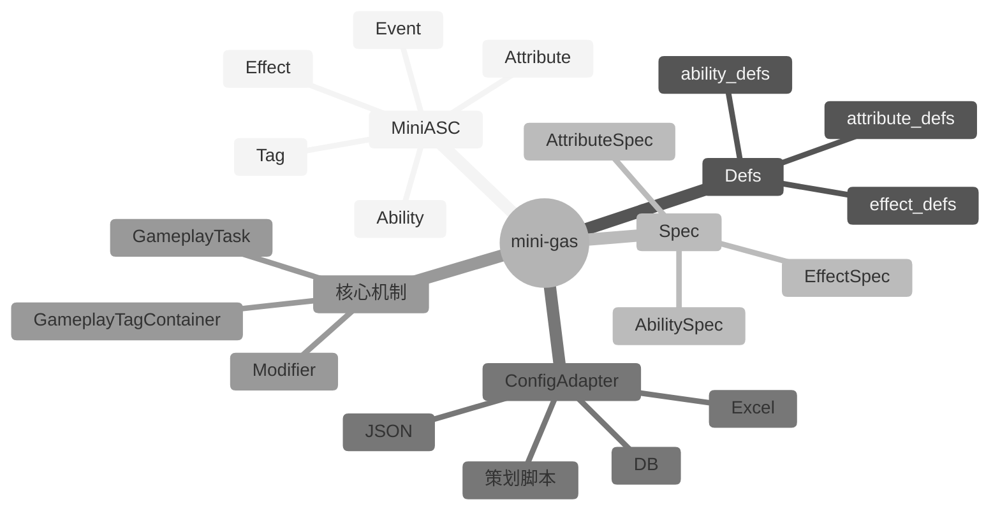

# Mini-GAS 设计文档

> 文档版本：v2.0  
> 编写日期：2026-06-14  
> 目标读者：服务端开发者、数值/系统策划  
> 关联项目：[cgas](../../../) — 基于 Lua 的 GAS 库

---

## 总览

本文为 `mini-gas` v2.0 设计文档，采用总分结构组织。各分文档说明如下：

| 文档 | 说明 |
|------|------|
| [README.md](./README.md) | 背景、目标、范围 |
| [architecture.md](./architecture.md) | 核心设计原则与架构 |
| [types.md](./types.md) | 枚举与核心类型定义 |
| [core-mechanisms.md](./core-mechanisms.md) | Tag、Attribute、Modifier、Effect、Ability、Event、Task 机制 |
| [spec-system.md](./spec-system.md) | Spec 系统与成长性 |
| [config-bridge.md](./config-bridge.md) | 配置桥接设计 |
| [api-reference.md](./api-reference.md) | 目录结构与 API 参考 |
| [implementation-notes.md](./implementation-notes.md) | 实现要点与版本历史 |
| [examples.md](./examples.md) | 使用示例 |

---

## 1. 背景与目标

### 1.1 背景

Gameplay Ability System（GAS）参考 Unreal Engine 的设计思想，覆盖 Ability、AttributeSet、Effect、Tag、Cue、Task 等子系统，适合客户端+服务端联动的复杂战斗系统。

但在很多服务端场景中，我们仍需要一个**轻量、独立、可成长**的 GAS 核心：

- 英雄、宠物、装备、技能、Buff 的成长性计算。
- 标签驱动的技能激活、效果触发、状态机切换。
- 支持永久、瞬时、持续、周期性多种 Effect。
- 支持冷却、消耗、Stack、等级缩放。
- **代码自包含**，避免与外部 GAS 实现相互污染，便于独立演进与维护。

因此设计 `mini-gas` v2.0：在保留 GAS 核心思想（Ability / Tag / Effect / Modifier / Attribute）的同时，构建一个**自包含、Spec 驱动、面向成长**的轻量服务端 GAS 引擎。

### 1.2 目标

- **核心子系统**：具备 GameplayAbility、GameplayTag、GameplayEffect、Modifier、Attribute 等核心能力。
- **代码独立**：目录独立为 `lua_lib/mini_gas`，不依赖任何外部 GAS 实现或共享源码文件。
- **Spec 驱动成长**：所有可成长对象（Ability / Effect / Attribute）均通过 Spec 定义，支持等级、Stack、按类型公式函数。
- **无魔术字符串**：所有标识符、标签、属性名、操作类型均通过 `@enum` 常量或 `@class` 类型定义，禁止在业务代码中直接书写字面量。
- **状态完全自包含**：运行时状态对象不引用任何外部对象（包括配置 Def、下划线查找表），可直接序列化与网络同步。
- **Defs 分离**：配置定义集中存放在 `Defs` 表中，由调用方持有并在需要的 API 中传入。
- **配置无关**：不绑定任何配置格式，通过适配器函数桥接任意配置源。

---

## 2. 范围

### 2.1 包含内容

| 模块 | 说明 |
|------|------|
| GameplayAbility（技能） | 主动/被动/响应式技能，含激活条件、冷却、消耗、等级、Stack |
| GameplayTag（标签） | 层级标签系统，支持精确匹配、父级匹配、Granted 标签管理 |
| GameplayEffect（效果） | 对 Attribute 的修改单元，支持 Instant / Infinite / HasDuration / Periodic |
| Modifier（修饰器） | 对属性的修改方式：Add、Multiply、Override、Compound |
| Attribute（属性） | 数值定义，支持 Base 值与 Current 值；成长由外部系统负责 |
| MiniASC（能力系统组件） | 运行时入口，操作 Ability、Effect、Attribute、Tag |
| GameplayEvent（游戏事件） | 技能与效果之间的触发/监听机制 |
| GameplayTask（轻量任务） | 延时、周期、等待事件等轻量异步任务 |
| Defs（配置定义表） | 集中存放 AttributeDef / AbilityDef / EffectDef |
| Spec 系统 | AbilitySpec、EffectSpec、AttributeSpec，支持等级、Stack、按类型公式 |
| ConfigAdapter（配置适配器） | 将外部配置转换为 Def 的桥梁 |

### 2.2 明确不包含

- 网络同步 / 客户端预测 / 服务端权威回滚
- 3D 渲染 / 动画 / 音效表现层（GameplayCue 可保留事件层，但不包含具体渲染）
- 物理 / 碰撞检测
- 数据持久化（由业务方负责）
- 复杂可视化编辑器

> 当项目需要这些能力时，应通过外部系统扩展或在架构上将 `mini-gas` 作为独立层通过适配器桥接。

---
