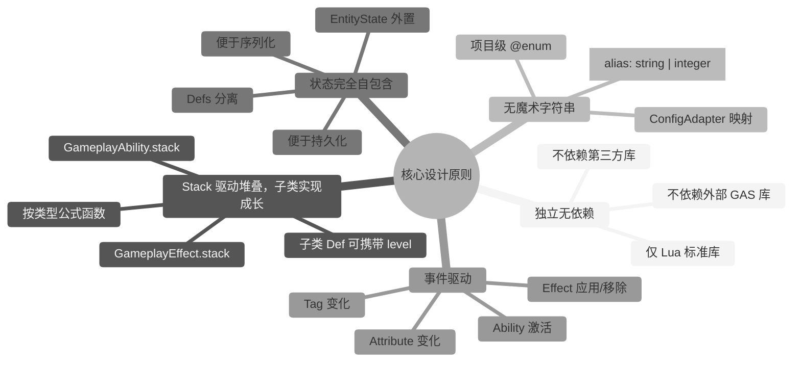
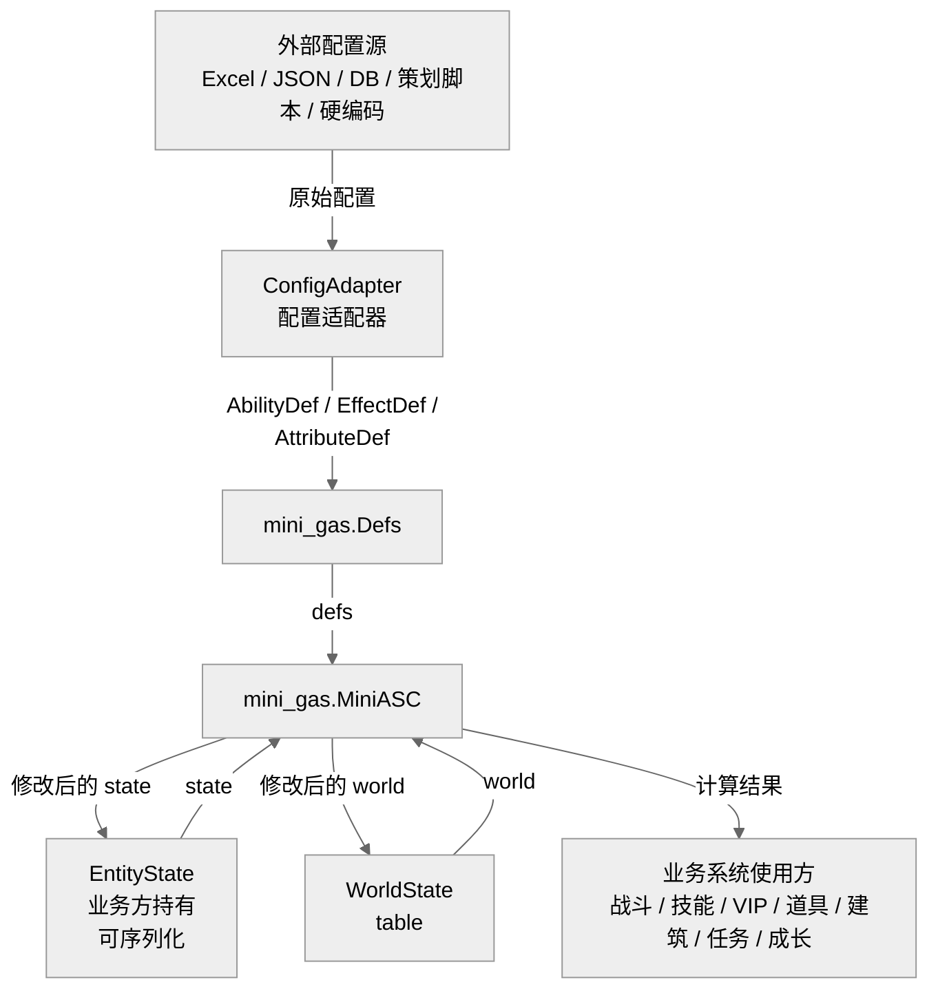
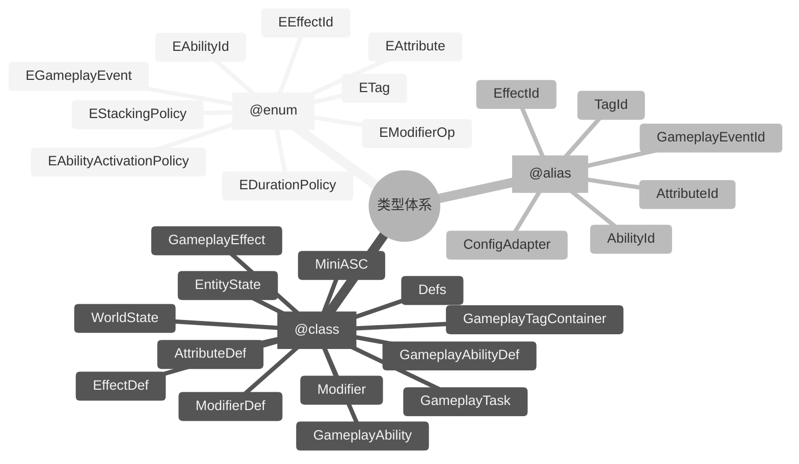

## 3. 核心设计原则

### 3.1 独立无依赖

`mini-gas` 仅依赖 Lua 标准库，不依赖任何外部 GAS 库或第三方库。所有类型、工具函数均在 `lua_lib/mini_gas` 内自包含。

### 3.2 Stack 驱动堆叠，子类实现成长

`mini-gas` 基类只保留运行时必需字段。`GameplayAbility` / `GameplayEffect` 的 `stack` 字段描述堆叠层数；而等级、成长曲线等由业务子类在 `Def` 中自行携带（如 `level` 字段），实例化时复制到运行时对象。公式函数读取这些子类字段完成数值缩放：

- `AbilityDef.cooldown` / `AbilityDef.cost[attr]`：`fun(self: GameplayAbility): number`
- `EffectDef.duration` / `EffectDef.period`：`fun(self: GameplayEffect): number`
- `ModifierDef.value`（Compound）：`fun(self: Modifier, v: number): number`

基类不预定义 `level`，避免把成长模型硬编码进框架。

### 3.3 无魔术字符串

所有标识符均通过 `@enum` 或 `@class` 定义，且其值对应策划配置的 `alias`（`string | integer`）：

- 属性名：`mini_gas.EAttribute`（框架不预定义业务属性；由策划配置）
- 标签名：`mini_gas.ETag`（框架不预定义业务标签；由策划配置）
- 技能 ID：`mini_gas.EAbilityId`（框架不预定义业务技能；由策划配置）
- 效果 ID：`mini_gas.EEffectId`（框架不预定义业务效果；由策划配置）
- 事件名：`mini_gas.EGameplayEvent`（框架仅预定义生命周期事件；业务事件由策划配置）
- 修饰操作：`mini_gas.EModifierOp`
- 生命周期策略：`mini_gas.EDurationPolicy`
- 技能激活策略：`mini_gas.EAbilityActivationPolicy`

业务代码禁止直接书写 `"attr.max_hp"`、`"Add"`、`"ability.attack"` 等字面量。业务 ID 应由策划配置并通过 `ConfigAdapter` 映射到项目级 `@enum`。

### 3.4 状态完全自包含

`mini-gas` 的运行时状态对象（`EntityState` / `Modifier` / `GameplayEffect` / `GameplayAbility` / `GameplayTask`）均为无元表的普通 Lua 表，且**不引用任何外部对象**（包括配置 Def、下划线查找表、其他运行时实例）。运行时数据在创建时即复制完整的 Def 信息，可直接序列化、持久化与网络同步。

配置定义集中存放在 `Defs` 表中，由调用方持有，并在需要的 API 调用中传入。

### 3.5 事件驱动

技能激活、效果触发、标签变化、属性变化均通过 `GameplayEvent` 进行通知，便于业务系统扩展。

---

## 4. 架构

---

---

> [返回 Mini-GAS 设计文档总览](./README.md)
