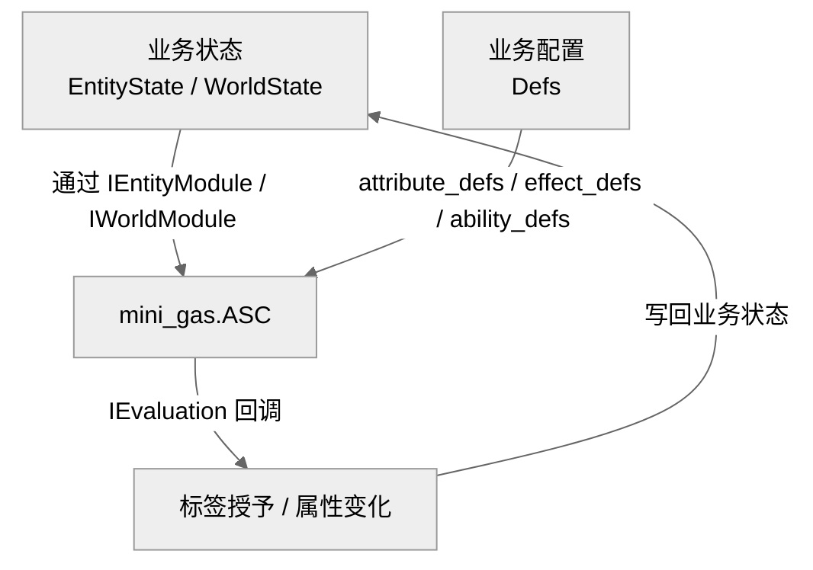

## 1. 核心设计原则

### 1.1 快照式全量求值

MiniGas V2 不维护运行时状态，也不推进时间。调用方持有世界状态、实体模块、世界模块与配置定义，通过 `ASC.evaluate` 一次性计算世界最终状态。

### 1.2 接口化解耦

库只定义访问接口（`IEntityModule`、`IWorldModule`、`IEvaluation`），不强制使用特定的状态结构。业务方可以使用普通 Lua 表、ECS、数据库行或网络同步状态。

### 1.3 被动-only

V2 仅支持 `Passive` 能力激活策略。能力在满足条件时自动生效，无主动触发、冷却、消耗、Stack 等机制。

### 1.4 标签驱动

层级标签是能力激活与 Modifier 生效的核心条件。通过 `allof_tags`、`anyof_tags`、`noneof_tags` 实现复杂的条件加成。

---

## 2. 架构



---

## 3. 接口说明

### 3.1 IEntityModule

提供访问实体状态的函数。所有迭代器均返回 `(iterator, state)` 二元组。

```lua
---@class mini_gas.IEntityModule
---@field static_tags fun(entity: mini_gas.IEntityState): mini_gas.Iterator, any
---@field static_tags_size fun(entity: mini_gas.IEntityState): integer
---@field has_static_tag fun(entity: mini_gas.IEntityState, tag: mini_gas.Tag): boolean
---@field attributes fun(entity: mini_gas.IEntityState): mini_gas.Iterator, any
---@field attributes_size fun(entity: mini_gas.IEntityState): integer
---@field has_attribute fun(entity: mini_gas.IEntityState, id: mini_gas.ID): boolean
---@field get_attribute fun(entity: mini_gas.IEntityState, id: mini_gas.ID): number
---@field static_abilities fun(entity: mini_gas.IEntityState): mini_gas.Iterator, any
---@field static_abilities_size fun(entity: mini_gas.IEntityState): integer
---@field has_static_ability fun(entity: mini_gas.IEntityState, def_id: mini_gas.ID): boolean
```

### 3.2 IWorldModule

提供访问世界状态的函数。

```lua
---@class mini_gas.IWorldModule
---@field entities fun(context: mini_gas.IContext, world: mini_gas.IWorldState): mini_gas.Iterator, any
---@field entities_size fun(context: mini_gas.IContext, world: mini_gas.IWorldState): integer
---@field has_entity fun(context: mini_gas.IContext, world: mini_gas.IWorldState, id: mini_gas.ID): boolean
---@field get_entity fun(context: mini_gas.IContext, world: mini_gas.IWorldState, id: mini_gas.ID): mini_gas.IEntityState, mini_gas.IEntityModule
```

### 3.3 IEvaluation

求值回调接口，由业务方实现。核心接口为 `apply`，在能力实体（owner）的所有 Ability 处理完毕后调用一次，传递该 owner 产生的所有授予标签与属性变化。

可选的 `begin_* / end_*` 回调用于调用方记录日志或执行其他副作用；若不需要，可省略。

```lua
---@class mini_gas.IEvaluation
---@field begin_ability? fun(context: mini_gas.IContext, world: mini_gas.IWorldState, world_module: mini_gas.IWorldModule, defs: mini_gas.Defs, owner_id: mini_gas.ID, owner_entity: mini_gas.IEntityState, owner_module: mini_gas.IEntityModule, ability_def_id: mini_gas.ID, ...: unknown)
---@field end_ability? fun(context: mini_gas.IContext, world: mini_gas.IWorldState, world_module: mini_gas.IWorldModule, defs: mini_gas.Defs, owner_id: mini_gas.ID, owner_entity: mini_gas.IEntityState, owner_module: mini_gas.IEntityModule, ability_def_id: mini_gas.ID, ...: unknown)
---@field begin_effect? fun(context: mini_gas.IContext, world: mini_gas.IWorldState, world_module: mini_gas.IWorldModule, defs: mini_gas.Defs, owner_id: mini_gas.ID, owner_entity: mini_gas.IEntityState, owner_module: mini_gas.IEntityModule, ability_def_id: mini_gas.ID, effect_def_id: mini_gas.ID, ...: unknown)
---@field end_effect? fun(context: mini_gas.IContext, world: mini_gas.IWorldState, world_module: mini_gas.IWorldModule, defs: mini_gas.Defs, owner_id: mini_gas.ID, owner_entity: mini_gas.IEntityState, owner_module: mini_gas.IEntityModule, ability_def_id: mini_gas.ID, effect_def_id: mini_gas.ID, ...: unknown)
---@field begin_modifier? fun(context: mini_gas.IContext, world: mini_gas.IWorldState, world_module: mini_gas.IWorldModule, defs: mini_gas.Defs, owner_id: mini_gas.ID, owner_entity: mini_gas.IEntityState, owner_module: mini_gas.IEntityModule, ability_def_id: mini_gas.ID, effect_def_id: mini_gas.ID, modifier_def: mini_gas.ModifierDef, target_entity: mini_gas.IEntityState, target_module: mini_gas.IEntityModule, ...: unknown)
---@field end_modifier? fun(context: mini_gas.IContext, world: mini_gas.IWorldState, world_module: mini_gas.IWorldModule, defs: mini_gas.Defs, owner_id: mini_gas.ID, owner_entity: mini_gas.IEntityState, owner_module: mini_gas.IEntityModule, ability_def_id: mini_gas.ID, effect_def_id: mini_gas.ID, modifier_def: mini_gas.ModifierDef, target_entity: mini_gas.IEntityState, target_module: mini_gas.IEntityModule, ...: unknown)
---@field apply fun(context: mini_gas.IContext, world: mini_gas.IWorldState, world_module: mini_gas.IWorldModule, defs: mini_gas.Defs, owner_id: mini_gas.ID, owner_entity: mini_gas.IEntityState, owner_module: mini_gas.IEntityModule, granted_tags: mini_gas.GrantedTagEntry[], attr_changes: mini_gas.AttrChangeEntry[], ...: unknown)
```

---

> [返回 Mini-GAS 设计文档总览](./README.md)
