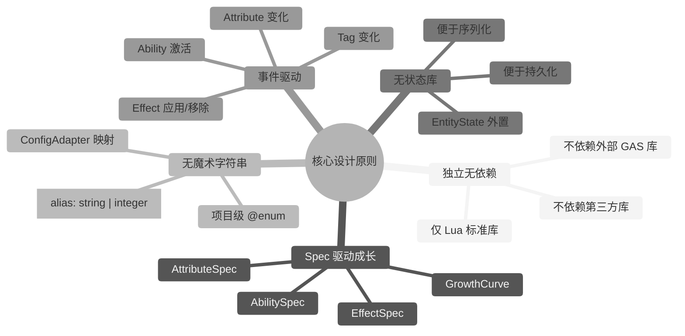
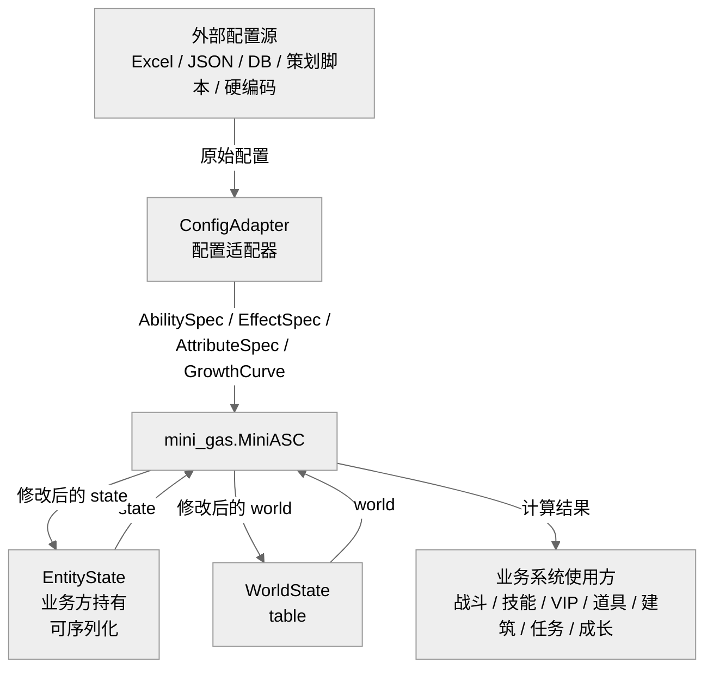
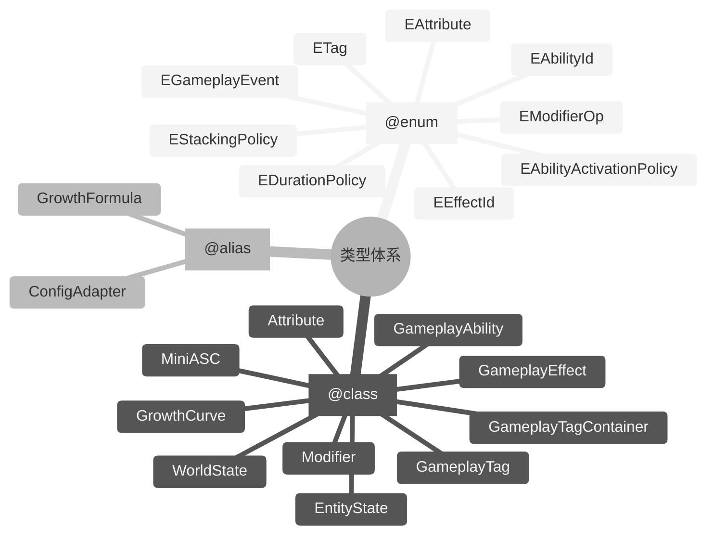

## 3. 核心设计原则

### 3.1 独立无依赖

`mini-gas` 仅依赖 Lua 标准库，不依赖任何外部 GAS 库或第三方库。所有类型、工具函数均在 `lua_lib/mini_gas` 内自包含。

### 3.2 Spec 驱动成长

游戏中的英雄、技能、装备、Buff 都具有成长性。`mini-gas` 通过 **Spec** 描述这些对象的等级、Stack、成长曲线，运行时由 `MiniASC` 根据 Spec 实例化并更新。

### 3.3 无魔术字符串

所有标识符均通过 `@enum` 或 `@class` 定义，且其值对应策划配置的 `alias`（`string | integer`）：

- 属性名：`mini_gas.EAttribute`（框架不预定义业务属性；由策划配置）
- 标签名：`mini_gas.ETag`（框架不预定义业务标签；由策划配置）
- 技能 ID：`mini_gas.EAbilityId`（框架不预定义业务技能；由策划配置）
- 效果 ID：`mini_gas.EEffectId`（框架不预定义业务效果；由策划配置）
- 事件名：`mini_gas.EGameplayEvent`（框架仅预定义生命周期事件；业务事件由策划配置）
- 修饰操作：`mini_gas.EModifierOp`
- 生命周期策略：`mini_gas.EDurationPolicy`
- 技能激活策略：`mini_gas.EAbilityActivationPolicy`

业务代码禁止直接书写 `"attr.max_hp"`、`"Add"`、`"ability.attack"` 等字面量。业务 ID 应由策划配置并通过 `ConfigAdapter` 映射到项目级 `@enum`。

### 3.4 无状态库

`mini-gas` 自身不维护任何运行时状态。所有状态由调用方通过 `EntityState` 传入并持有，业务系统可同时存在任意多个 `EntityState` 实例，互不干扰。状态外置后可直接序列化，便于保存、加载、网络同步与回放。

### 3.5 事件驱动

技能激活、效果触发、标签变化、属性变化均通过 `GameplayEvent` 进行通知，便于业务系统扩展。

---

## 4. 架构

---

---

> [返回 Mini-GAS 设计文档总览](./README.md)
