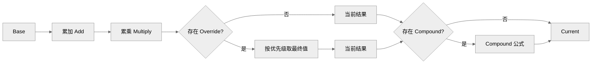
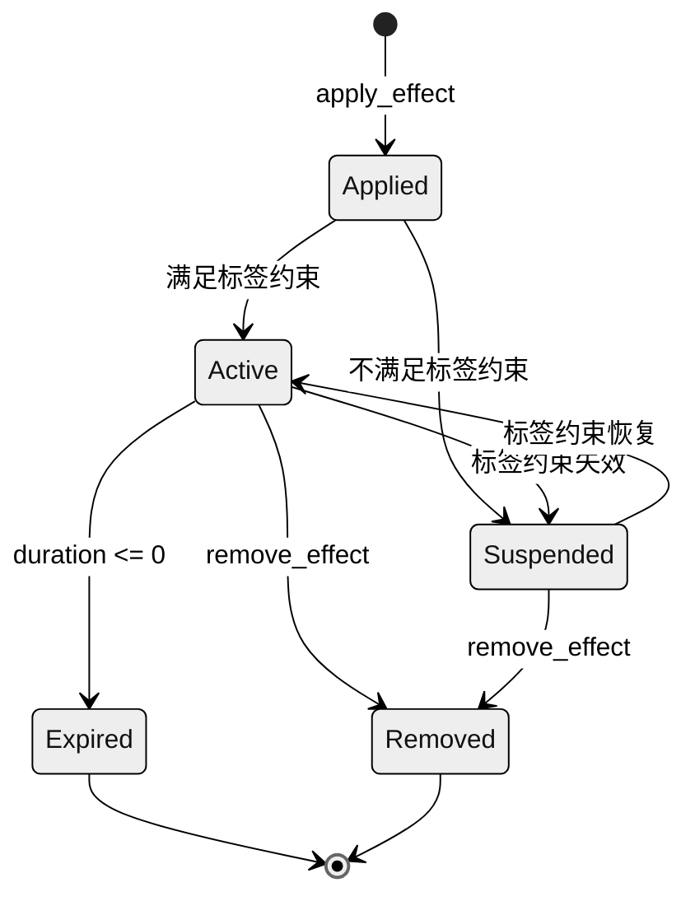
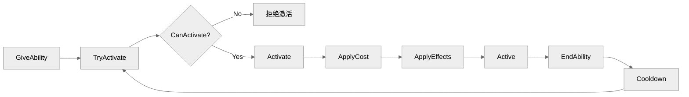
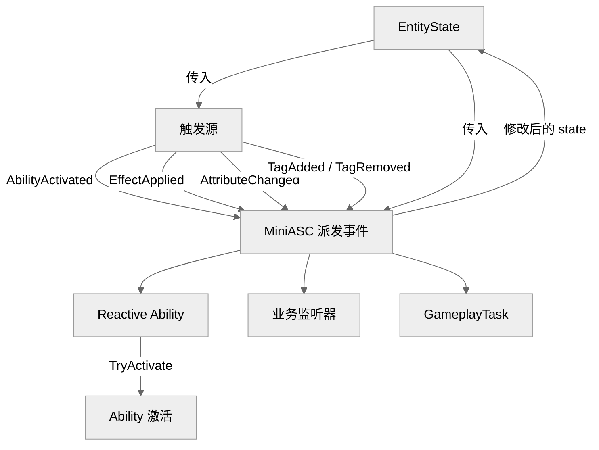

## 6. 核心机制

### 6.1 GameplayTag

#### 6.1.1 层级语义

标签采用点分层级结构，例如 `state.dead`、`effect.burning`。父级标签匹配所有子级标签：`state` 匹配 `state.dead`，`state.dead` 不匹配 `state.stunned`。

#### 6.1.2 Granted 标签（赋予标签）

- **Ability** 授予或 **Effect** 应用时，可通过 `grant_tags` / `granted_tags` 自动向实体添加一组标签。
- 技能/效果移除时，对应 Granted 标签自动移除（引用计数）。
- **效果的赋予应优先通过标签实现**：例如 VIP 效果授予 `buff.vip` 标签，建筑产出效果的倍率 Modifier 通过 `require_tags = {buff.vip}` 启用，从而实现系统间的相互影响，无需额外的跨实体链接机制。

#### 6.1.3 标签约束

- **Require Tags（需求标签）**：必须全部存在，技能/效果/Modifier 才能激活或生效。
- **Blocked Tags（禁用标签）**：任意一个存在，技能/效果/Modifier 即不能激活或生效。
- 约束检查在技能激活、效果应用、效果持续生效、Modifier 聚合时均会执行。

### 6.2 Attribute

#### 6.2.1 Base 与 Current

`EntityState.attributes` 是普通 `table<AttributeId, number>`：

- **Base / Current 已提交值**：`state.attributes[attr_id]` 存储的是已提交值， Instant 效果或 `set_current` 会直接修改它。
- **Current 读取值**：`MiniASC.get_current(state, defs, attr_id)` 在已提交值基础上叠加生效的持续 Modifier，并 Clamp 到边界。

#### 6.2.2 属性成长

`AttributeDef` 不再定义公式。属性 Base 值、成长、升级等由外部系统负责，例如：

```lua
-- 外部系统按等级计算后写入 state.attributes
state.attributes[attr_id] = external_calc(level)
```

#### 6.2.3 数值边界

每个 Attribute 可配置 `min` 与 `max`。`Current` 值在每次计算后被 Clamp 到边界内。`Hp` 等属性特别适合使用边界约束。

### 6.3 Modifier

#### 6.3.1 聚合顺序

以 `state.attributes[attr_id]` 已提交值（会被 Instant 效果或 `set_current` 修改）为起点，按以下顺序计算最终读取值：



#### 6.3.2 Modifier 标签约束

每个 Modifier 可单独配置 `require_tags` 与 `blocked_tags`。聚合时，只有满足标签约束的 Modifier 才会参与计算。这允许通过标签动态开启/关闭特定加成，例如：

- VIP 效果授予 `buff.vip` 标签。
- 建筑产出效果中的倍率 Modifier 设置 `require_tags = {buff.vip}`，仅在英雄拥有 VIP 时生效。

#### 6.3.3 数值与 Compound

Modifier 的 `value` 类型为 `number`（用于 `Add` / `Multiply` / `Override`）或 `fun(self: Modifier, v: number): number`（仅用于 `Compound`）。

Modifier 运行时实例仅保留 `effect_id`、`index` 与 `stack`，配置通过传入的 `defs` 查找。若需要按等级成长，应由 `ConfigAdapter` 在 `apply_effect` 前按目标等级生成对应的 `number` 值，或在 Compound 公式中通过闭包捕获等级信息。

### 6.4 GameplayEffect

#### 6.4.1 生命周期策略

| 策略 | 说明 |
|------|------|
| Instant | 立即执行一次 Modifier（修改 Current），不进入持续效果列表 |
| Infinite | 永久生效，直到被显式移除 |
| HasDuration | 持续 `duration` 秒后自动移除 |

`duration` 支持常量或公式函数 `fun(self: GameplayEffect, ...): number`。

#### 6.4.2 周期性效果

当 `period > 0` 时，Effect 在持续期间每隔 `period` 秒触发一次 Modifier 应用（通常是 `Add` 类型的资源产出或回血）。`period` 同样支持常量或公式函数。

#### 6.4.3 Stack 规则

- 同一 `effect_id` 再次应用时，根据 `stacking` 策略处理。
- `None`：重复应用时替换旧效果。
- `Add`：Stack 数增加，不超过 `max_stack`。
- `Replace`：用新效果替换旧效果。
- `Refresh`：刷新持续时间，Stack 数不变或取较大值。

#### 6.4.4 标签约束

效果在应用时和每帧更新时都会检查 `require_tags` 与 `blocked_tags`。若不再满足条件，效果进入挂起状态，不应用 Modifier；条件恢复后继续生效。

此外，效果内部每个 Modifier 也有独立的 `require_tags` / `blocked_tags`。即使效果本身处于激活状态，不满足约束的单个 Modifier 也不会参与聚合。这实现了精细化的标签驱动加成。



### 6.5 GameplayAbility

#### 6.5.1 生命周期



#### 6.5.2 激活策略

| 策略 | 说明 |
|------|------|
| Passive | 授予后自动持续生效，通常用于天赋、光环 |
| Active | 需要业务方显式调用 `try_activate_ability` |
| Reactive | 监听指定 `activation_event`，事件发生时自动尝试激活 |

#### 6.5.3 激活条件

- 技能处于非冷却状态。
- 满足 `require_tags` 且不满足 `blocked_tags`。
- 满足消耗条件（Cost）。
- 业务可自定义 `can_activate` 回调。

#### 6.5.4 消耗

Cost 是一组 `{attribute, value}`，激活时从 `Current` 值中扣除。`value` 支持常量或公式函数 `fun(self: GameplayAbility, ...): number`。若任意一项不足，激活失败。

#### 6.5.5 冷却

- 技能激活后进入冷却，`cooldown_remaining` 从 `cooldown` 开始倒数。
- `cooldown` 支持常量或公式函数 `fun(self: GameplayAbility, ...): number`。

#### 6.5.6 激活时效果

技能激活时可自动应用一组 `EffectDef`，用于实现伤害、Buff、Debuff 等。

### 6.6 MiniASC

`MiniASC` 是 `mini-gas` 的运行时核心，但**自身不持有任何状态**。它以 `EntityState` 与 `Defs` 为输入，职责包括：

- 读取并修改传入的 `EntityState` 中的 Attribute、Effect、Ability、Tag。
- 每帧 `update(state, defs, dt)` 时推进 Effect 生命周期、触发周期效果、推进技能冷却。
- 通过 `update_world(world, defs, dt)` 批量推进 `WorldState` 中所有实体的生命周期，便于统一更新。
- 执行 Modifier 聚合，计算 Attribute Current 值。
- 派发事件并通知 `EntityState` 中的监听者。
- 处理 Stack、等级与公式化数值的动态更新。

由于状态完全自包含，`EntityState` 与 `WorldState` 可随时被序列化、保存、加载或通过网络同步；`Defs` 作为独立配置表也可单独管理。

### 6.7 GameplayEvent

事件是技能与效果之间解耦通信的重要手段：

- 技能激活/结束、效果应用/移除、标签变化、属性变化均会触发事件。
- Reactive 技能通过监听事件自动尝试激活。
- 业务系统可监听事件实现日志、任务、统计等功能。详见 [event.md](./event.md)。



### 6.8 GameplayTask

`GameplayTask` 提供延时、周期、等待事件三类轻量异步任务，保存在 `EntityState.tasks` 中，由 `MiniASC.update` 统一推进。详见 [task.md](./task.md)。

---

---

> [返回 Mini-GAS 设计文档总览](./README.md)
