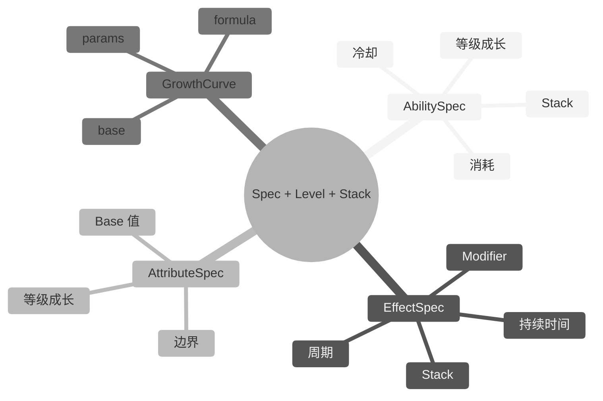

## 7. Spec 系统（成长性）

### 7.1 设计目标

游戏中的对象普遍具有成长性：英雄升级、技能升级、装备强化、Buff 层数变化。`mini-gas` 通过 **Spec + Level + Stack** 模型统一描述成长性：

- **Spec**：定义对象的所有静态配置（如一个技能的冷却、消耗、效果）。
- **Level**：描述等级成长，影响数值、冷却、消耗、持续时间等。
- **Stack**：描述叠加层数，影响效果强度或触发次数。



### 7.2 AbilitySpec

```lua
---@class mini_gas.AbilitySpec
---@field def mini_gas.GameplayAbilityDef
---@field level number
---@field stack number
```

AbilitySpec 保存一个技能在特定等级与 Stack 下的实例化信息，是对 `def + level + stack` 的结构化封装。`MiniASC.give_ability(state, ...)` 直接接收 `GameplayAbilityDef` 与等级/Stack 参数，内部构造 `GameplayAbility` 写入 `state`。

### 7.3 EffectSpec

```lua
---@class mini_gas.EffectSpec
---@field def mini_gas.EffectDef
---@field level number
---@field stack number
```

EffectSpec 保存一个效果在特定等级与 Stack 下的实例化信息，是对 `def + level + stack` 的结构化封装。`MiniASC.apply_effect(state, ...)` 直接接收 `EffectDef` 与等级/Stack 参数，内部构造 `GameplayEffect` 写入 `state`。

### 7.4 AttributeSpec

```lua
---@class mini_gas.AttributeSpec
---@field def mini_gas.AttributeDef
---@field level number
```

AttributeSpec 保存一个属性在特定等级下的 Base 值。当前 `MiniASC.register_attributes(state, defs)` 在注册时按等级 1 初始化 Base；若业务需要在运行时调整属性等级，可直接修改 `state.attributes[attr_id].base` 并派发 `AttributeChanged` 事件。

### 7.5 GrowthCurve 公式

`GrowthCurve` **只能通过公式计算**，不支持等级查表。业务方提供任意 `GrowthFormula`，框架在需要时调用：

```lua
---@param level number 当前等级
---@param base number 基础值
---@param params table|nil 公式参数
---@return number
local function linear_growth(level, base, params)
    return base + (level - 1) * (params and params.growth or 0)
end
```

公式可以是线性、指数、对数、分段函数等任何形式，只要符合 `GrowthFormula` 签名即可。策划配置中应描述公式类型与参数，由 `ConfigAdapter` 转换为具体的 `GrowthCurve`。

---

---

> [返回 Mini-GAS 设计文档总览](./README.md)
