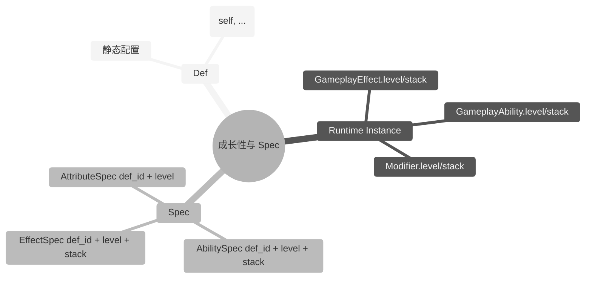

## 7. Spec 系统（业务层结构化封装）

### 7.1 设计定位

`mini-gas` 的成长性由运行时实例自身承载：`GameplayAbility` / `GameplayEffect` / `Modifier` 均携带 `level` 与 `stack` 字段，而对应的 `AbilityDef` / `EffectDef` / `ModifierDef` 通过公式函数读取这些字段完成数值计算。

`Spec` 位于**业务层**，是对一次实例化请求的轻量结构化封装：

```lua
local spec = mini_gas.AbilitySpec.new(EAbilityId.Fireball, level, stack)
local def = defs.ability_defs[spec.def_id]
MiniASC.give_ability(state, defs, def, spec.level, spec.stack)
```

框架内部（`MiniASC`）不识别 `Spec`，只接收 `Def + level + stack`。这样避免在框架内部做脆弱的 `Def/Spec` 类型推断，同时让业务层保留统一的请求结构。



### 7.2 AbilitySpec

```lua
---@class mini_gas.AbilitySpec
---@field def_id mini_gas.AbilityId
---@field level number
---@field stack number
```

AbilitySpec 保存一次技能授予请求的参数。业务方从 `Defs` 中查找 `GameplayAbilityDef` 后调用 `MiniASC.give_ability(state, defs, def, spec.level, spec.stack)`。

### 7.3 EffectSpec

```lua
---@class mini_gas.EffectSpec
---@field def_id mini_gas.EffectId
---@field level number
---@field stack number
```

EffectSpec 保存一次效果应用请求的参数。业务方从 `Defs` 中查找 `EffectDef` 后调用 `MiniASC.apply_effect(state, defs, def, spec.level, spec.stack)`。

### 7.4 AttributeSpec

```lua
---@class mini_gas.AttributeSpec
---@field def_id mini_gas.AttributeId
---@field level number
```

AttributeSpec 保存属性相关的等级元信息，**不进入 `MiniASC.register_attributes`**。`mini-gas` 的属性成长性由 `Effect`（Modifier）驱动，而非属性自身的等级。业务方若需要按等级初始化属性 base 值，应在调用 `register_attributes` 前由 `ConfigAdapter` 根据 `AttributeSpec.level` 生成对应的 `AttributeDef.base`。

### 7.5 按类型公式函数

`mini-gas` 不定义通用的 `GrowthCurve` 类型。每种 Def 的公式使用与对应运行时实例绑定的签名：

- `AbilityDef.cooldown` / `AbilityDef.cost[attr]`：`fun(self: GameplayAbility, ...): number`
- `EffectDef.duration` / `EffectDef.period`：`fun(self: GameplayEffect, ...): number`
- `ModifierDef.value`（Compound）：`fun(self: Modifier, v: number): number`

示例：

```lua
---@param base number
---@param growth number
---@return fun(self: mini_gas.GameplayAbility): number
local function ability_linear(base, growth)
    return function(self)
        return base + (self.level - 1) * growth
    end
end

local fireball_def = {
    id = EAbilityId.Fireball,
    cooldown = ability_linear(5, -0.2),
    cost = {
        [EAttribute.Mp] = ability_linear(20, 2),
    },
}
```

> 注意：`ModifierDef.value` 仅支持 `number` 或 `fun(self: Modifier, v: number): number`（用于 `Compound`）。若 Modifier 需要随等级成长，应在 `apply_effect` / `give_ability` 前由 `ConfigAdapter` 按目标等级生成对应的 `number` 值。

---

> [返回 Mini-GAS 设计文档总览](./README.md)
