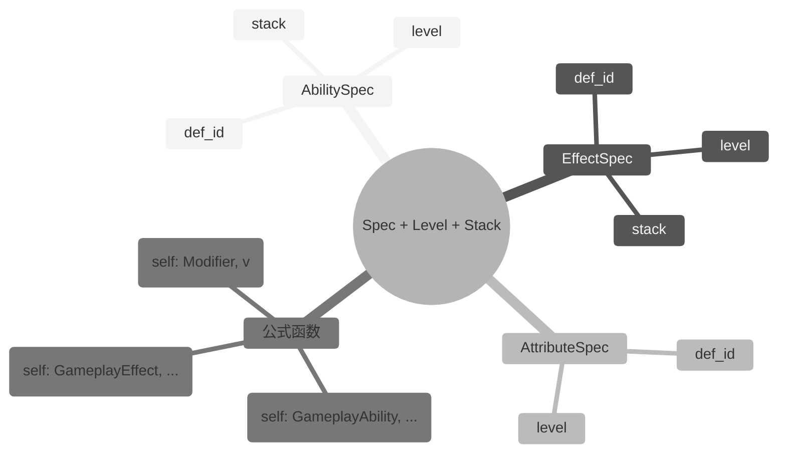

## 7. Spec 系统（成长性）

### 7.1 设计目标

游戏中的对象普遍具有成长性：英雄升级、技能升级、装备强化、Buff 层数变化。`mini-gas` 通过 **Spec + Level + Stack** 模型统一描述成长性：

- **Spec**：定义对象的所有静态配置（如一个技能的冷却、消耗、效果）。
- **Level**：描述等级成长，影响数值、冷却、消耗、持续时间等。
- **Stack**：描述叠加层数，影响效果强度或触发次数。

运行时，配置 Def 被复制为**自包含**的运行时实例：`GameplayAbility` / `GameplayEffect` / `Modifier`。这些实例不引用外部 Def，可直接序列化。



### 7.2 AbilitySpec

```lua
---@class mini_gas.AbilitySpec
---@field def_id mini_gas.AbilityId
---@field level number
---@field stack number
```

AbilitySpec 保存一个技能在特定等级与 Stack 下的实例化信息，是对 `def_id + level + stack` 的结构化封装。`MiniASC.give_ability(state, defs, def, level, stack)` 直接接收 `GameplayAbilityDef` 与等级/Stack 参数，内部构造自包含的 `GameplayAbility` 写入 `state`。

### 7.3 EffectSpec

```lua
---@class mini_gas.EffectSpec
---@field def_id mini_gas.EffectId
---@field level number
---@field stack number
```

EffectSpec 保存一个效果在特定等级与 Stack 下的实例化信息，是对 `def_id + level + stack` 的结构化封装。`MiniASC.apply_effect(state, defs, def, level, stack)` 直接接收 `EffectDef` 与等级/Stack 参数，内部构造自包含的 `GameplayEffect` 写入 `state`。

### 7.4 AttributeSpec

```lua
---@class mini_gas.AttributeSpec
---@field def_id mini_gas.AttributeId
---@field level number
```

AttributeSpec 保存一个属性在特定等级下的值。`MiniASC.register_attributes(state, defs, attr_defs)` 在注册时按 `AttributeDef.base` 初始化 `state.attributes`；若业务需要在运行时调整属性等级，应由外部系统计算后修改 `state.attributes[attr_id]` 并派发 `AttributeChanged` 事件。

### 7.5 按类型公式函数

`mini-gas` 不定义通用的 `GrowthCurve` 类型。每种 Def 的公式使用与对应运行时实例绑定的签名：

- `AbilityDef.cooldown` / `AbilityDef.cost[attr]`：`fun(self: GameplayAbility, ...): number`
- `EffectDef.duration` / `EffectDef.period`：`fun(self: GameplayEffect, ...): number`
- `ModifierDef.value`（Compound）：`fun(self: Modifier, v: number): number`

示例：

```lua
---@param base number
---@param growth number
---@return fun(self: mini_gas.GameplayAbility): number
local function ability_linear(base, growth)
    return function(self)
        return base + (self.level - 1) * growth
    end
end

local fireball_def = {
    id = EAbilityId.Fireball,
    cooldown = ability_linear(5, -0.2),
    cost = {
        [EAttribute.Mp] = ability_linear(20, 2),
    },
}
```

> 注意：`ModifierDef.value` 仅支持 `number` 或 `fun(self: Modifier, v: number): number`（用于 `Compound`）。若 Modifier 需要随等级成长，应在 `apply_effect` / `give_ability` 前由 `ConfigAdapter` 按目标等级生成对应的 `number` 值。

---

> [返回 Mini-GAS 设计文档总览](./README.md)
