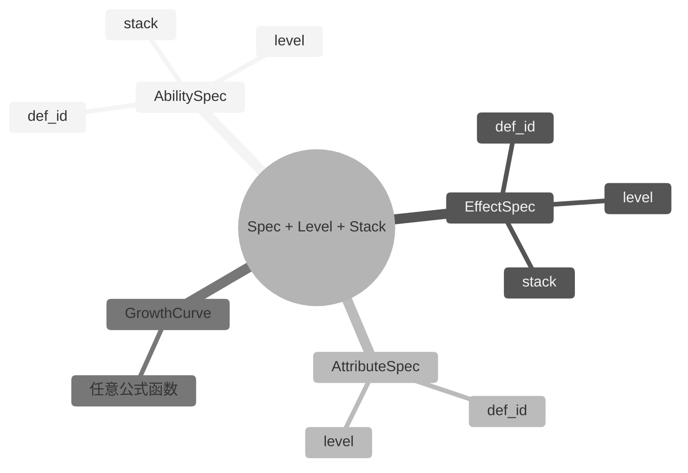

## 7. Spec 系统（成长性）

### 7.1 设计目标

游戏中的对象普遍具有成长性：英雄升级、技能升级、装备强化、Buff 层数变化。`mini-gas` 通过 **Spec + Level + Stack** 模型统一描述成长性：

- **Spec**：定义对象的所有静态配置（如一个技能的冷却、消耗、效果）。
- **Level**：描述等级成长，影响数值、冷却、消耗、持续时间等。
- **Stack**：描述叠加层数，影响效果强度或触发次数。



### 7.2 AbilitySpec

```lua
---@class mini_gas.AbilitySpec
---@field def_id mini_gas.AbilityId
---@field level number
---@field stack number
```

AbilitySpec 保存一个技能在特定等级与 Stack 下的实例化信息，是对 `def_id + level + stack` 的结构化封装。`MiniASC.give_ability(state, def, level, stack)` 直接接收 `GameplayAbilityDef` 与等级/Stack 参数，内部构造 `GameplayAbility`（引用 `spec_id = def.id`）写入 `state`。

### 7.3 EffectSpec

```lua
---@class mini_gas.EffectSpec
---@field def_id mini_gas.EffectId
---@field level number
---@field stack number
```

EffectSpec 保存一个效果在特定等级与 Stack 下的实例化信息，是对 `def_id + level + stack` 的结构化封装。`MiniASC.apply_effect(state, def, level, stack)` 直接接收 `EffectDef` 与等级/Stack 参数，内部构造 `GameplayEffect`（引用 `spec_id = def.id`）写入 `state`。

### 7.4 AttributeSpec

```lua
---@class mini_gas.AttributeSpec
---@field def_id mini_gas.AttributeId
---@field level number
```

AttributeSpec 保存一个属性在特定等级下的值。`MiniASC.register_attributes(state, defs)` 在注册时按等级 1 初始化 `state.attributes`；若业务需要在运行时调整属性等级，可直接修改 `state.attributes[attr_id]` 并派发 `AttributeChanged` 事件。

### 7.5 GrowthCurve 公式

`GrowthCurve` 是任意公式函数，不强制 `base` / `params` 字段，也不限定仅按等级成长。业务方提供任意函数签名 `fun(level: number, ...): number`，框架在需要时调用：

```lua
---@param level number 当前等级
---@return number
local function linear_growth(level)
    return 100 + (level - 1) * 10
end
```

公式可以是线性、指数、对数、分段函数等任何形式。策划配置中应描述公式类型与参数，由 `ConfigAdapter` 转换为具体的 `GrowthCurve`。

> 注意：`ModifierDef.value` 仅支持 `number` 或 `fun(self: Modifier, v: number): number`（用于 `Compound`）。若 Modifier 需要随等级成长，应在 `apply_effect` / `give_ability` 前由 `ConfigAdapter` 按目标等级生成对应的 `number` 值。

---

> [返回 Mini-GAS 设计文档总览](./README.md)
