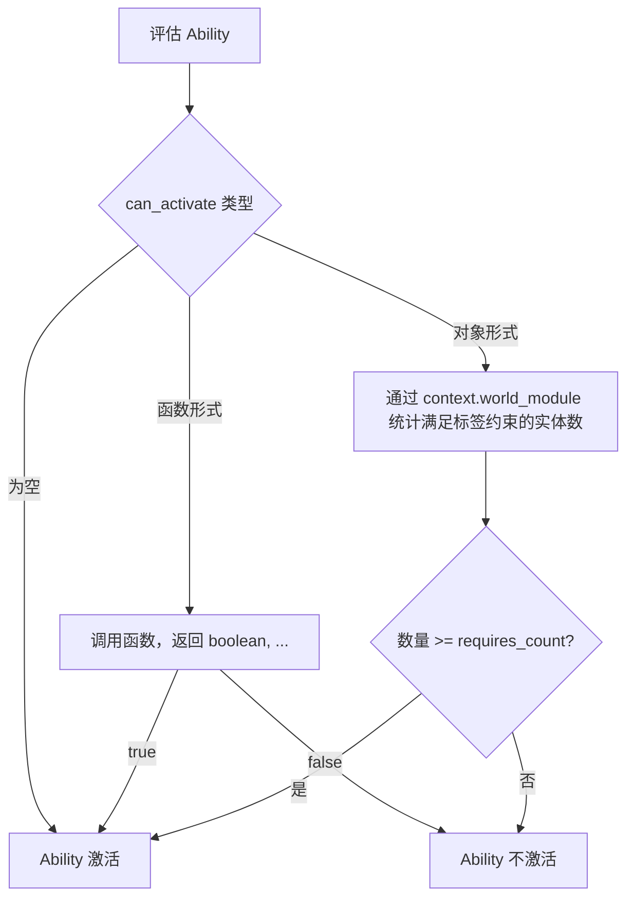
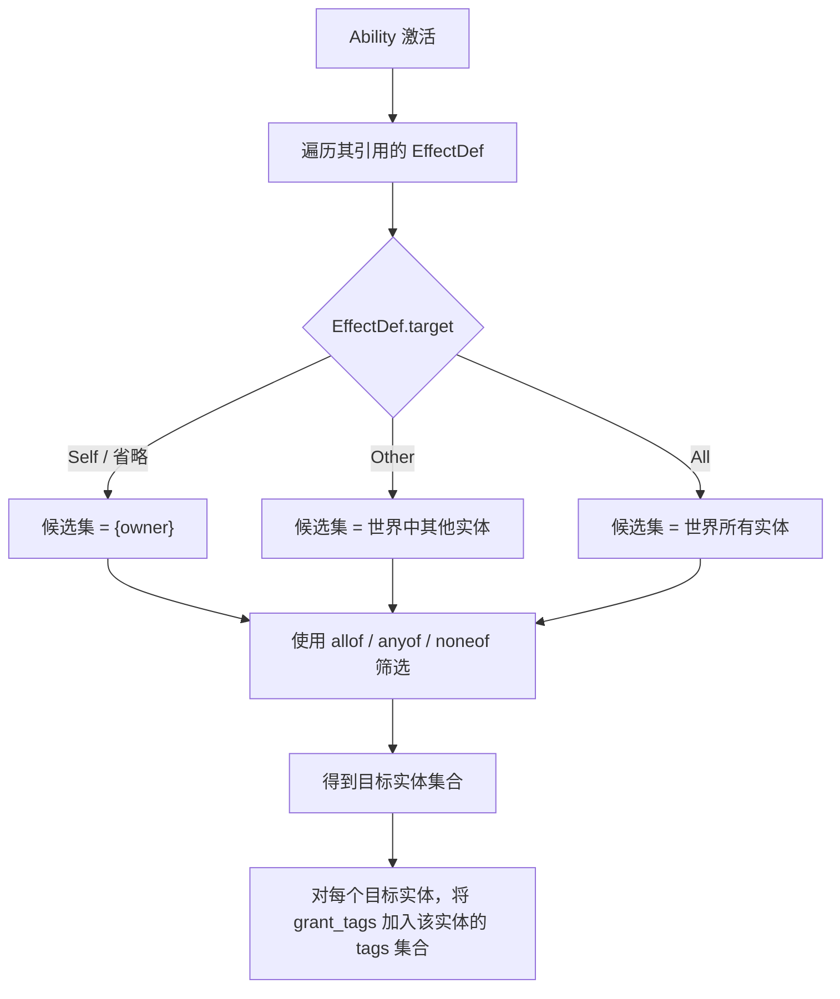
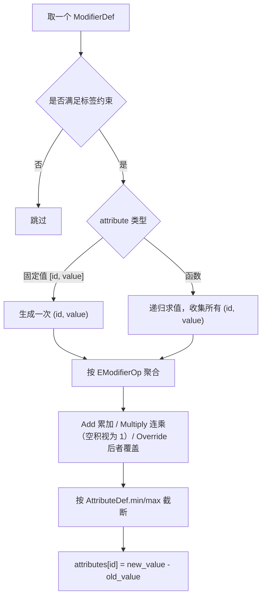
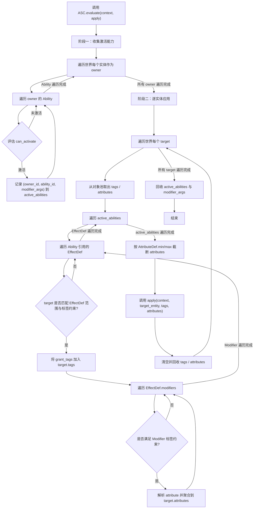

# MiniGas V2

## 概述

MiniGas V2 是 MiniGas 的第二个版本，是一次完全重构。

**设计目标**：
- 在服务器端以快照方式对世界状态进行全量求值，计算实体之间的相互作用。
- 通过接口化设计（`IEntityModule`、`IWorldModule`、`IContext`、`IDebug` / `ApplyFun`）方便与现有系统集成，不强制使用框架内置的状态结构。
- 仅保留 Passive Ability，无主动技能、冷却、消耗、Tick 推进等复杂机制，保持核心最小化。

**适用场景**：
- 英雄、宠物、装备、建筑等成长性数值计算。
- 基于标签的 Buff/Debuff、光环、VIP 特权等条件加成。
- 需要一次性计算世界最终状态，而非逐帧推进的离线或服务端快照场景。

**明确不包含**：
- 主动/响应式技能、冷却、消耗、Stack 堆叠。
- 时间推进（Tick）、周期效果触发、延时任务。
- 网络同步、客户端预测、持久化、渲染表现层。

当项目需要上述能力时，应在 MiniGas V2 之上由业务系统自行扩展，或通过业务层适配桥接到其他 GAS 实现。

## 目录结构

```
lua_lib/
└── mini_gas/                 -- 独立目录
    ├── init.lua              -- 模块入口，导出公共 API
    ├── types.lua             -- LuaCATS 类型定义集中文件
    ├── enum.lua              -- 枚举常量定义
    ├── asc.lua               -- 核心求值入口与主控流程（轻量）
    ├── tag.lua               -- 层级标签匹配工具
    ├── ability.lua           -- Ability 激活条件与 active_abilities 收集
    ├── effect.lua            -- Effect 目标匹配与应用
    ├── modifier.lua          -- Modifier 解析与属性聚合
    ├── pool.lua              -- 分类对象池
    └── debug.lua             -- 调试钩子辅助函数
```

> MiniGas V2 为自包含实现，所有代码均在 `lua_lib/mini_gas/` 内，不依赖任何外部 GAS 库。

## 数据结构

### 通用定义

```lua

---@alias mini_gas.ID integer | string
---@alias mini_gas.Tag string
---@alias mini_gas.Iterator<P1> fun(state: any, key?: any): P1 返回单个迭代值的 Lua 迭代器
---@alias mini_gas.Iterator2<P1, P2> fun(state: any, key?: any): P1, P2 返回两个迭代值的 Lua 迭代器
---@alias mini_gas.Iterator3<P1, P2, P3> fun(state: any, key?: any): P1, P2, P3 返回三个迭代值的 Lua 迭代器

---@enum mini_gas.EModifierOp
local EModifierOp = {
    Add = 1, --- 加法：将多个 Add 修改量累加
    Multiply = 2, --- 乘法：将多个 Multiply 修改量连乘
    Override = 3, --- 覆盖：同一属性的多个 Override 按生效顺序取最后一个值
}

---能力激活策略，只支持 Passive（被动）一种：能力在满足条件时自动激活，无需玩家主动触发。
---@enum mini_gas.EAbilityActivationPolicy
local EAbilityActivationPolicy = {
    Passive = 1, --- 被动
}

---效果目标范围。
---最终目标实体还会受 EffectDef 自身的 allof_tags / anyof_tags / noneof_tags 进一步筛选。
---@enum mini_gas.EEffectTarget
local EEffectTarget = {
    Self = 1,  --- 仅对能力所属实体自身生效
    Other = 2, --- 对世界中的其他实体生效
    All = 3,   --- 对世界中的所有实体生效，包含能力所属实体自身
}

---@class mini_gas.AttributeDef
---@field id mini_gas.ID
---@field min? number 属性最小值约束；若定义，ApplyFun 最终拿到的 attributes[id] 已截断到该边界内
---@field max? number 属性最大值约束；若定义，ApplyFun 最终拿到的 attributes[id] 已截断到该边界内

---@class mini_gas.Defs
---@field attribute_defs table<mini_gas.ID, mini_gas.AttributeDef>
---@field effect_defs table<mini_gas.ID, mini_gas.EffectDef>
---@field ability_defs table<mini_gas.ID, mini_gas.AbilityDef>

local ASC = {}

---@param a mini_gas.Tag
---@param b mini_gas.Tag
function ASC.match_tag(a, b)
    if a == b then
        return true
    end
    if b == "" then
        return false
    end
    return a:find(b, 1, true) == 1 and a:byte(#b + 1) == 46
end

---判断实体是否拥有与给定标签模式匹配的标签
---@param entity mini_gas.IEntityState
---@param module mini_gas.IEntityModule
---@param pattern mini_gas.Tag
---@return boolean
function ASC.entity_match_tag(entity, module, pattern)
    if module.has_static_tag(entity, pattern) then
        return true
    end
    for tag in module.static_tags(entity) do
        if ASC.match_tag(tag, pattern) then
            return true
        end
    end
    return false
end

---@param entity mini_gas.IEntityState
---@param module mini_gas.IEntityModule
---@param allof_tags? mini_gas.Tag[]
---@param anyof_tags? mini_gas.Tag[]
---@param noneof_tags? mini_gas.Tag[]
---@return boolean 是否满足标签约束
function ASC.match_tags(entity, module, allof_tags, anyof_tags, noneof_tags)
    if allof_tags and #allof_tags > 0 then
        for _, pattern in ipairs(allof_tags) do
            if not ASC.entity_match_tag(entity, module, pattern) then
                return false
            end
        end
    end
    if anyof_tags and #anyof_tags > 0 then
        local any_match = false
        for _, pattern in ipairs(anyof_tags) do
            if ASC.entity_match_tag(entity, module, pattern) then
                any_match = true
                break
            end
        end
        if not any_match then
            return false
        end
    end
    if noneof_tags and #noneof_tags > 0 then
        for _, pattern in ipairs(noneof_tags) do
            if ASC.entity_match_tag(entity, module, pattern) then
                return false
            end
        end
    end
    return true
end

-- 层级标签匹配用例
-- local module = {
--     has_static_tag = function(entity, tag) return entity.tags[tag] ~= nil end,
--     static_tags = function(entity) return pairs(entity.tags) end,
-- }
-- local entity = { tags = { ["state.dead"] = true, ["buff.vip"] = true } }
-- assert(ASC.match_tags(entity, module, {"state"}) == true)          -- state.dead 匹配 state
-- assert(ASC.match_tags(entity, module, {"state.dead"}) == true)    -- 精确匹配
-- assert(ASC.match_tags(entity, module, nil, {"state.stunned", "buff.vip"}) == true) -- anyof 命中 buff.vip
-- assert(ASC.match_tags(entity, module, nil, nil, {"state.stunned"}) == true)        -- noneof 未命中
-- assert(ASC.match_tags(entity, module, nil, nil, {"state"}) == false)               -- noneof 命中 state.dead

```

### 系统上下文

```lua

---系统状态接口，由库的使用者实现
---@class mini_gas.IContext
---@field world mini_gas.IWorldState 世界状态
---@field world_module mini_gas.IWorldModule 访问 world 的模块接口
---@field defs mini_gas.Defs 属性、效果、能力定义
---@field debug? mini_gas.IDebug 可选调试/追踪接口
--- 业务方可按需要扩展其它字段

```

### 实体定义

IEntityState 定义了实体的状态，实体的访问，操作由 IEntityModule 提供，IEntityModule 有如下字段：
- 静态标签：实体固有的标签，不会随时间变化。
- 属性：实体的数值属性，如生命值、魔法值等。
- 静态技能：实体固有的技能，不会随时间变化。

```lua

---实体状态
---@class mini_gas.IEntityState

---实体模块接口，提供访问实体状态的函数。
---所有迭代器函数均返回“迭代函数 + 状态”二元组，业务方实现时应使用 `return next, collection` 或 `return pairs(collection)`，
---切勿直接返回 `pairs, collection`，否则 `for ... in module.xxx(entity)` 会因把 `pairs` 本身当作迭代函数而导致死循环。
---@class mini_gas.IEntityModule
---@field static_tags fun(entity: mini_gas.IEntityState): mini_gas.Iterator<mini_gas.Tag>, any 实体的静态标签迭代器，返回 (iterator, state)
---@field static_tags_size fun(entity: mini_gas.IEntityState): integer 实体的静态标签数量
---@field has_static_tag fun(entity: mini_gas.IEntityState, tag: mini_gas.Tag): boolean 实体是否具有某个静态标签
---@field attributes fun(entity: mini_gas.IEntityState): mini_gas.Iterator2<mini_gas.ID, number>, any 实体的属性迭代器，返回 (iterator, state)
---@field attributes_size fun(entity: mini_gas.IEntityState): integer 实体的属性数量
---@field has_attribute fun(entity: mini_gas.IEntityState, id: mini_gas.ID): boolean 实体是否具有某个属性
---@field get_attribute fun(entity: mini_gas.IEntityState, id: mini_gas.ID): number 实体的属性值
---@field static_abilities fun(entity: mini_gas.IEntityState): mini_gas.Iterator2<mini_gas.ID, boolean>, any 实体的静态技能迭代器，返回 (iterator, state)
---@field static_abilities_size fun(entity: mini_gas.IEntityState): integer 实体的静态技能数量
---@field has_static_ability fun(entity: mini_gas.IEntityState, def_id: mini_gas.ID): boolean 实体是否具有某个静态技能

```

### 世界状态

IWorldState 定义世界状态，其访问操作由 IWorldModule 提供，IWorldModule 提供实体访问能力：
- 实体访问：提供访问世界中实体的函数，包括实体的迭代器、数量、是否存在某个实体、获取某个实体的状态等。
- 求值入口由库提供的 `ASC.evaluate` 承担；世界状态与世界模块通过 `IContext` 传入。

```lua

--- 世界状态接口
---@class mini_gas.IWorldState

---世界模块接口，提供访问世界状态的函数。
---迭代器函数同样返回“迭代函数 + 状态”二元组，实现方式与 IEntityModule 的迭代器一致。
---@class mini_gas.IWorldModule
---@field entities fun(context: mini_gas.IContext): mini_gas.Iterator3<mini_gas.ID, mini_gas.IEntityState, mini_gas.IEntityModule>, any 世界中实体的迭代器，返回 (iterator, state)；迭代器每次产出 (id, entity, entity_module)
---@field entities_size fun(context: mini_gas.IContext): integer 世界中实体的数量
---@field has_entity fun(context: mini_gas.IContext, id: mini_gas.ID): boolean 世界中是否存在某个实体
---@field get_entity fun(context: mini_gas.IContext, id: mini_gas.ID): mini_gas.IEntityState, mini_gas.IEntityModule 获取世界中某个实体的状态

```

### 求值接口

求值由两部分组成：用于调试/追踪生命周期的 `IDebug`，以及用于最终写入结果的 `ApplyFun`。

```lua

---调试/追踪接口，所有方法均为可选。
---所有方法尾部的 `...` 均为 `ASC.evaluate` 调用者传入的上下文参数，与 `ModifierAttributeEval` 收到的 `modifier_args` 不同。
---@class mini_gas.IDebug
---@field begin_ability? fun(context: mini_gas.IContext, owner_id: mini_gas.ID, owner_entity: mini_gas.IEntityState, owner_module: mini_gas.IEntityModule, ability_id: mini_gas.ID, ...: unknown) 开始评估某个 Ability
---@field end_ability? fun(context: mini_gas.IContext, owner_id: mini_gas.ID, owner_entity: mini_gas.IEntityState, owner_module: mini_gas.IEntityModule, ability_id: mini_gas.ID, ...: unknown) 结束评估某个 Ability
---@field begin_effect? fun(context: mini_gas.IContext, owner_id: mini_gas.ID, owner_entity: mini_gas.IEntityState, owner_module: mini_gas.IEntityModule, ability_id: mini_gas.ID, effect_id: mini_gas.ID, ...: unknown) 开始应用某个 Effect
---@field end_effect? fun(context: mini_gas.IContext, owner_id: mini_gas.ID, owner_entity: mini_gas.IEntityState, owner_module: mini_gas.IEntityModule, ability_id: mini_gas.ID, effect_id: mini_gas.ID, ...: unknown) 结束应用某个 Effect
---@field begin_modifier? fun(context: mini_gas.IContext, owner_id: mini_gas.ID, owner_entity: mini_gas.IEntityState, owner_module: mini_gas.IEntityModule, ability_id: mini_gas.ID, effect_id: mini_gas.ID, modifier_def: mini_gas.ModifierDef, target_entity: mini_gas.IEntityState, target_module: mini_gas.IEntityModule, ...: unknown) 开始评估某个 Modifier
---@field end_modifier? fun(context: mini_gas.IContext, owner_id: mini_gas.ID, owner_entity: mini_gas.IEntityState, owner_module: mini_gas.IEntityModule, ability_id: mini_gas.ID, effect_id: mini_gas.ID, modifier_def: mini_gas.ModifierDef, target_entity: mini_gas.IEntityState, target_module: mini_gas.IEntityModule, ...: unknown) 结束评估某个 Modifier
---@field step? fun(context: mini_gas.IContext, phase: string, ...: unknown) 通用步骤钩子，phase 由库定义（如 "evaluate_start" / "evaluate_end" / "missing_effect" / "invalid_modifier_attribute"）

---最终应用函数：每个实体在全部求值完成后调用一次。
---尾部的 `...` 为 `ASC.evaluate` 调用者传入的上下文参数。
---@alias mini_gas.ApplyFun fun(context: mini_gas.IContext, entity: mini_gas.IEntityState, tags: table<mini_gas.Tag, boolean>, attributes: table<mini_gas.ID, number>, ...: unknown)
--- tags 为本次求值授予该实体的所有标签集合（{ [tag] = true }）
--- attributes 为属性 ID 到 add 语义差值的映射（new_value - old_value），业务方应将其加到旧值上得到最终值

-- ASC 已在“通用定义”中定义，其求值入口如下：

---@param context mini_gas.IContext 系统上下文，由库的使用者实现，包含 world、world_module、defs、可选的 debug 以及业务方自定义字段
---@param apply mini_gas.ApplyFun 最终应用函数
---@param ... unknown 其他上下文信息，由 evaluate 的调用者传入，通常包含一些触发事件的来源等
function ASC.evaluate(context, apply, ...)

end

```

### ModifierDef

ModifierDef 定义了 Modifier 的属性和行为，定义如下：

```lua

---ModifierDef 中 attribute 字段的函数形式定义。
---参数包括系统上下文、实体状态、ModifierDef 本身，以及可选的 id 和 value 参数；若需访问世界状态或定义，可通过 context.world / context.defs 获取。
---返回一个属性 ID、一个数值，以及一个可选的下一个求值函数；若第三个返回值非 nil，则递归调用该函数继续求值。每次递归返回的 `(id, value)` 都作为一次独立的属性修改参与后续聚合。
---首次调用时，id 与 value 均为 nil；后续递归调用时，id 与 value 分别为上一次调用返回的 id 与 value。
---参数尾部的 ... 始终为当前 Ability 产生的 modifier_args，其来源如下：
--- - 当 AbilityDef.can_activate 为 AbilityActivateCondition 对象形式时，modifier_args = { count, ... }，其中 count 为满足该条件标签约束的实体数量，后续 ... 来自 ASC.evaluate 调用者传入的上下文；
--- - 当 AbilityDef.can_activate 为 AbilityActivateConditionFunc 函数形式时，modifier_args 即为该函数返回的 ...；
--- - 当 AbilityDef.can_activate 为空时，Ability 默认激活，modifier_args 即为 ASC.evaluate 调用者传入的上下文。
---@alias mini_gas.ModifierAttributeEval fun(context:mini_gas.IContext, entity: mini_gas.IEntityState, def: mini_gas.ModifierDef, id?: mini_gas.ID, value?: number, ...: unknown): mini_gas.ID, number, mini_gas.ModifierAttributeEval?

---@class mini_gas.ModifierDef
---@field attribute [mini_gas.ID, number] | mini_gas.ModifierAttributeEval
---@field op mini_gas.EModifierOp
---@field allof_tags? mini_gas.Tag[]
---@field anyof_tags? mini_gas.Tag[]
---@field noneof_tags? mini_gas.Tag[]

```

> attribute 字段可以是一个固定的属性 ID 和数值，也可以是一个函数，如果是函数，则返回一个属性 ID 和数值的元组以及一个可选的函数，如果返回了可选的函数，则递归调用该函数。

### EffectDef

EffectDef 定义了 Effect 的属性和行为，定义如下：

```lua

---@class mini_gas.EffectDef
---@field id mini_gas.ID
---@field modifiers mini_gas.ModifierDef[]
---@field grant_tags? mini_gas.Tag[] 对目标实体应用的标签
---@field allof_tags? mini_gas.Tag[] 效果对目标实体生效的标签约束；当 target 为 Other / All 时用于筛选目标实体，为 Self 时用于筛选能力所属实体自身
---@field anyof_tags? mini_gas.Tag[]
---@field noneof_tags? mini_gas.Tag[]
---@field target? mini_gas.EEffectTarget 效果目标范围；省略时默认为 Self

```

### AbilityDef

AbilityDef 定义了 Ability 的属性和行为，定义如下：

```lua

---激活条件（对象形式）
---当 can_activate 为该对象形式时，库会在世界中查找满足本条件标签约束的实体数量；
---该数量会作为 ModifierAttributeEval 函数末尾可变参数的第一个参数传入，其余参数来自 ASC.evaluate 调用者传入的上下文信息。
---@class mini_gas.AbilityActivateCondition
---@field allof_tags? mini_gas.Tag[]
---@field anyof_tags? mini_gas.Tag[]
---@field noneof_tags? mini_gas.Tag[]
---@field requires_count integer 激活所需的最小匹配实体数量；当满足上述标签约束的实体数量大于等于该值时，Ability 激活；省略时默认值为 1；设为 0 时表示无需匹配任何实体即可激活
---@field include_self? boolean 统计匹配实体数量时是否包含当前实体自身；默认为 true

---激活条件函数
---参数 ... 由 ASC.evaluate 的调用者传入，通常包含一些触发事件的来源等上下文信息；若需访问定义或世界状态，可通过 context.defs / context.world 获取。
---返回值的 ... 部分会作为 ModifierAttributeEval 函数末尾可变参数传入。
---@alias mini_gas.AbilityActivateConditionFunc fun(context:mini_gas.IContext, entity: mini_gas.IEntityState, def: mini_gas.AbilityDef, ...: unknown): boolean, unknown...

---@class mini_gas.AbilityDef
---@field id mini_gas.ID
---@field activation_policy mini_gas.EAbilityActivationPolicy
---@field effects mini_gas.ID[]
---@field can_activate? mini_gas.AbilityActivateCondition | mini_gas.AbilityActivateConditionFunc
```

> 由于 Ability 都是静态定义的，所以不提供 grant_tags 和标签约束字段。

## 系统流程

### 定义配置

开发者定义 `AttributeDef`、`ModifierDef`、`EffectDef` 和 `AbilityDef`，构建 `Defs`。

**属性初始值与边界约束**：
- 属性的旧值由 `IEntityModule.get_attribute(entity, id)` 决定，`AttributeDef` 本身不定义初始值。
- 不在 `Defs.attribute_defs` 中定义的属性，仍按 `IEntityModule.get_attribute` 的返回值作为旧值，且不检查最大值和最小值约束。
- 库在聚合所有生效的 Modifier 后，会按 `Defs.attribute_defs[id]` 中的 `min` 与 `max` 对最终值做截断；未定义 `min` 或 `max` 时，对应方向不限制。最终传给 `ApplyFun` 的 `attributes[id]` 已经是截断后的 `new_value - old_value`。

### 定义实体、世界状态与组装 IContext

1. 实现 `IEntityState` 与 `IEntityModule`，定义单个实体的状态与访问方式。
2. 实现 `IWorldState` 与 `IWorldModule`，定义世界的状态与实体访问方式。
3. 将 `world`、`world_module`、`defs` 以及可选的 `debug` 组装进 `context`。
4. 调用 `ASC.evaluate(context, apply, ...)` 进行全量求值；其中 `debug` 通过 `context.debug` 传入。

### 能力 can_activate 的流程



说明：
- 对象形式：库使用 `context.world_module` 统计满足 `allof_tags / anyof_tags / noneof_tags` 的实体数量；`include_self` 控制是否包含当前能力实体自身。该数量与 `ASC.evaluate` 调用者传入的上下文参数一起被打包进 `modifier_args`，供第二阶段 `ModifierAttributeEval` 使用。
- 函数形式：调用 `AbilityActivateConditionFunc`，返回的 `...` 被打包进 `modifier_args`，供第二阶段 `ModifierAttributeEval` 使用。
- 为空：Ability 默认激活，`modifier_args` 直接采用 `ASC.evaluate` 调用者传入的上下文参数。

### 应用效果的流程



说明：
- 该流程发生在求值第二阶段：库遍历每个 `target` 实体，并遍历第一阶段收集的 `active_abilities`。
- 对每个 `EffectDef`，先根据 `target` 确定候选目标集合，再用 `EffectDef` 自身的标签约束对候选集合做二次筛选；所有标签约束均只依据实体通过 `IEntityModule` 提供的静态标签进行判断。
- 对筛选后的每个目标实体，将其 `grant_tags` 加入该实体本次求值的 `tags` 集合（去重）；`grant_tags` 仅作为输出，不影响同一次 `ASC.evaluate` 内其它 Ability 的 `can_activate` 判定或 Modifier 的标签筛选。
- 若 `ability_def.effects` 中引用的 `effect_id` 在 `defs.effect_defs` 中不存在，库将跳过该 effect，并通过 `IDebug` 输出日志（若提供了 `IDebug`）。

### 应用 Modifier 的流程



说明：
- 该流程发生在求值第二阶段，针对每个 `target` 实体遍历 `active_abilities` 时执行。
- 先检查 `ModifierDef` 的标签约束，不满足则跳过。
- 若 `attribute` 为函数，递归调用直到第三个返回值为 `nil`；首次调用时 `id` 与 `value` 为 `nil`，后续递归调用传入上一次返回的 `(id, value)`，末尾可变参数始终为当前 Ability 的 `modifier_args`；每次递归返回的 `(id, value)` 都作为一次独立修改参与聚合。
- 若 `attribute` 既不是 `[id, value]` 数组也不是函数，则跳过该 Modifier，并通过 `IDebug` 输出日志（若提供了 `IDebug`）。
- 对同一目标实体的同一属性，按 `EModifierOp` 聚合：
  - `Add`：累加所有 Add 值，得到 `add_sum`。
  - `Multiply`：连乘所有 Multiply 值，得到 `multiply_product`；若不存在任何 Multiply modifier，则视为乘以 1（即不影响数值）。
  - `Override`：按遍历顺序取最后一个 Override 值，得到 `override_value`。
- 设 `base = IEntityModule.get_attribute(entity, id)`，聚合后的最终值计算规则为：
  - 若存在 Override modifier：`final = override_value`；
  - 否则：`final = (base + add_sum) * multiply_product`。
- 得到 `final` 后按 `Defs.attribute_defs[id]` 的 `min` / `max` 截断；`attributes[id]` 记录的是 add 语义差值 `final - base`。

### 求值的流程



说明：
- 实际实现采用两阶段流程：
  1. **收集阶段**：遍历世界所有实体作为 `owner`，再遍历每个 Ability；激活的能力以 `[owner_id, ability_id, modifier_args]` 三元组形式存入 `active_abilities`。
  2. **应用阶段**：再次遍历世界每个 `target` 实体，遍历 `active_abilities`，将可作用的 `grant_tags` 与 Modifier 结果聚合到该实体的 `tags` / `attributes` 中，最后调用一次 `ApplyFun`。
- 本次求值中所有标签约束（AbilityActivateCondition、EffectDef、ModifierDef）均只依据实体通过 `IEntityModule` 提供的静态标签进行判断；`grant_tags` 仅作为输出写入 `tags` 集合，不影响同一次 `ASC.evaluate` 内的其它判定。
- 每个 `target` 实体的 `tags` 与 `attributes` 从对象池取出，应用完毕后清空放回，避免频繁创建临时表。
- 若 `context.debug` 存在，库会在合适的时机调用 `begin_ability` / `end_ability` / `begin_effect` / `end_effect` / `begin_modifier` / `end_modifier` / `step` 等钩子。

### 求值实现：两阶段流程与对象池

`ASC.evaluate` 的实际实现采用“先收集、再应用、最后回收”的两阶段流程，并通过分类对象池复用中间表，避免每次求值产生大量临时 Lua 表。

#### 阶段一：收集激活能力

遍历世界中每个实体作为 `owner`，对其每个 Ability 评估 `can_activate`：

- 对象形式：通过 `context.world_module` 统计满足标签约束的实体数 `count`。
- 函数形式：调用 `AbilityActivateConditionFunc`，得到返回的 `...`。
- 为空：默认激活。

若 Ability 激活，将其信息按三元组追加到一维数组 `active_abilities`：

```
active_abilities[i * 3 - 2] = owner_id
active_abilities[i * 3 - 1] = ability_id
active_abilities[i * 3]     = modifier_args
```

其中 `modifier_args` 是打包后传给 `ModifierAttributeEval` 的参数：

- 对象形式：`{ count, ... }`，`count` 为匹配实体数，`...` 为 `ASC.evaluate` 调用者传入的上下文参数。
- 函数形式：函数返回的 `...` 直接打包。
- 为空：`ASC.evaluate` 调用者传入的上下文参数。

#### 阶段二：逐实体应用

再次遍历世界每个实体 `target`：

1. 从对象池取出并清空 `tags` 和 `attributes`。
2. 遍历 `active_abilities`（步长 3）：
   - 根据 `ability_id` 取得 `AbilityDef` 与 `effects`。
   - 对每个 `EffectDef`：
     - 判断 `target` 范围（Self / Other / All）与 `EffectDef` 标签约束是否允许作用于当前 `target`。
     - 若允许，将 `grant_tags` 加入 `tags`。
     - 遍历 `EffectDef.modifiers`：
       - 检查 `ModifierDef` 标签约束。
       - 解析 `attribute`（固定值或递归函数），得到 `(id, value)`。
       - 按 `EModifierOp` 聚合到 `attributes[id]`。
3. 对 `attributes` 中每个属性按 `AttributeDef.min/max` 截断，得到 add 语义差值 `new_value - old_value`。
4. 调用 `apply(context, target_entity, tags, attributes, ...)`，其中 `...` 为 `ASC.evaluate` 调用者传入的上下文参数。
5. 将 `tags` 和 `attributes` 清空后放回对象池。

#### 阶段三：回收对象池

求值结束后：

- 遍历 `active_abilities`，将每个 `modifier_args` 清空后放回通用对象池。
- 清空 `active_abilities` 本身，放回 `active_abilities_pool`。
- 清空 `evaluate_args`，放回 `evaluate_args_pool`。

#### 对象池分类

库内部使用以下分类对象池：

- `tags_pool`：复用每个 `target` 的 `tags` 表。
- `attrs_pool`：复用每个 `target` 的 `attributes` 聚合表。
- `evaluate_args_pool`：复用 `evaluate` 末尾可变参数表。
- `active_abilities_pool`：复用激活能力列表。
- `table_pool`：复用其他小型临时表（如 `modifier_args`、`deltas`、`attr_entry`、`pairs_list` 元素等）。

所有对象池均带有重复释放保护，避免同一张表在池中出现多次。

完整示例见 [example.md](example.md)。
